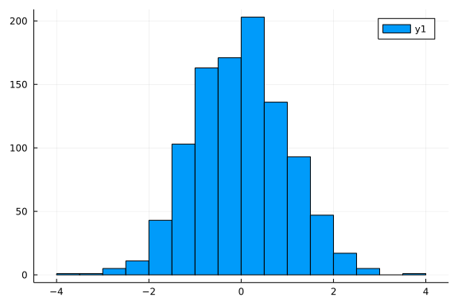
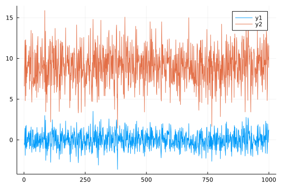
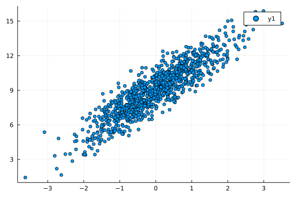

# A short introcuction to Julia


## Strings
String operations:

```julia
julia> "Hi " * "there!"       # string concatenation
"Hi there!"

julia> "Ho " ^ 3              # repeat string
"Ho Ho Ho "

julia> string("a = ", 123.3)  # create using print function
"a = 123.3"

julia> repr(123.3)            # fetch value of show function to a string
"123.3"

julia> occursin("CD", "ABCD") # check if the second string contains the first
true

julia> "\"\n\t\$"             # C-like escaping in strings, new \$ escape
       x = 123
Main.##WeaveSandBox#312.x

julia> "$x + 3 = $(x+3)"      # unescaped $ is used for interpolation
"123 + 3 = 126"

julia> "\$199"                # to get a $ symbol you must escape it
       s = "abc"              # a string of type String
Main.##WeaveSandBox#312.s

julia> chop(s)                # remove last character from s, returns a SubString
"ab"
```


## Vector and Matrix
Define a vector

```julia
julia> x = [121, 98, 95, 94, 102, 106, 112, 120, 108, 109]
10-element Vector{Int64}:
 121
  98
  95
  94
 102
 106
 112
 120
 108
 109
```


Define another vector

```julia
julia> xx = [123 2 3]
1×3 Matrix{Int64}:
 123  2  3
```


Define a character vector

```julia
julia> w = ["F","M","M","F","F","M","M","F","M","M"]
10-element Vector{String}:
 "F"
 "M"
 "M"
 "F"
 "F"
 "M"
 "M"
 "F"
 "M"
 "M"
```


Use `.` to broadcast. For example, define y to be the log transformation of x.

```julia
julia> y = log.(x)
10-element Vector{Float64}:
 4.795790545596741
 4.584967478670572
 4.553876891600541
 4.543294782270004
 4.624972813284271
 4.663439094112067
 4.718498871295094
 4.787491742782046
 4.68213122712422
 4.6913478822291435
```


Construct a 10 by 2 matrix, with columns x and y combine by columns

```julia
julia> mat = hcat(x, y)
10×2 Matrix{Float64}:
 121.0  4.79579
  98.0  4.58497
  95.0  4.55388
  94.0  4.54329
 102.0  4.62497
 106.0  4.66344
 112.0  4.7185
 120.0  4.78749
 108.0  4.68213
 109.0  4.69135

julia> mat = [x y]
10×2 Matrix{Float64}:
 121.0  4.79579
  98.0  4.58497
  95.0  4.55388
  94.0  4.54329
 102.0  4.62497
 106.0  4.66344
 112.0  4.7185
 120.0  4.78749
 108.0  4.68213
 109.0  4.69135
```


Combine by rows

```julia
julia> [x; y]
20-element Vector{Float64}:
 121.0
  98.0
  95.0
  94.0
 102.0
 106.0
 112.0
 120.0
 108.0
 109.0
   4.795790545596741
   4.584967478670572
   4.553876891600541
   4.543294782270004
   4.624972813284271
   4.663439094112067
   4.718498871295094
   4.787491742782046
   4.68213122712422
   4.6913478822291435
```


The following will create an array of arrays with length 2

```julia
julia> tmp = [x, y, "a", 'a']
4-element Vector{Any}:
 [121, 98, 95, 94, 102, 106, 112, 120, 108, 109]
 [4.795790545596741, 4.584967478670572, 4.553876891600541, 4.543294782270004, 4.624972813284271, 4.663439094112067, 4.718498871295094, 4.787491742782046, 4.68213122712422, 4.6913478822291435]
 "a"
 'a': ASCII/Unicode U+0061 (category Ll: Letter, lowercase)
```


Add another row to the data set

```julia
julia> new = [100 log(100)]
1×2 Matrix{Float64}:
 100.0  4.60517

julia> mat2 = vcat(mat, new)
11×2 Matrix{Float64}:
 121.0  4.79579
  98.0  4.58497
  95.0  4.55388
  94.0  4.54329
 102.0  4.62497
 106.0  4.66344
 112.0  4.7185
 120.0  4.78749
 108.0  4.68213
 109.0  4.69135
 100.0  4.60517

julia> [mat; new]
11×2 Matrix{Float64}:
 121.0  4.79579
  98.0  4.58497
  95.0  4.55388
  94.0  4.54329
 102.0  4.62497
 106.0  4.66344
 112.0  4.7185
 120.0  4.78749
 108.0  4.68213
 109.0  4.69135
 100.0  4.60517
```


Check the dimension of a matrix

```julia
julia> size(mat2)
(11, 2)
```


The number of columns of a matrix

```julia
julia> size(mat2, 2)
2
```


The number of rows of a matrix

```julia
julia> size(mat2, 1)
11
```


Value in the third row and the second column of mat

```julia
julia> mat[3,2]
4.553876891600541
```


The first three rows of mat

```julia
julia> mat[1:3,:]
3×2 Matrix{Float64}:
 121.0  4.79579
  98.0  4.58497
  95.0  4.55388
```


The second column of mat

```julia
julia> mat[:,2]
10-element Vector{Float64}:
 4.795790545596741
 4.584967478670572
 4.553876891600541
 4.543294782270004
 4.624972813284271
 4.663439094112067
 4.718498871295094
 4.787491742782046
 4.68213122712422
 4.6913478822291435
```


Exclude the second row

```julia
julia> mat[setdiff(1:end, 2),:]
9×2 Matrix{Float64}:
 121.0  4.79579
  95.0  4.55388
  94.0  4.54329
 102.0  4.62497
 106.0  4.66344
 112.0  4.7185
 120.0  4.78749
 108.0  4.68213
 109.0  4.69135
```


Exclude the second column

```julia
julia> mat[:,setdiff(1:end, 2)]
10×1 Matrix{Float64}:
 121.0
  98.0
  95.0
  94.0
 102.0
 106.0
 112.0
 120.0
 108.0
 109.0

julia> setdiff(1:8, [3, 5])
6-element Vector{Int64}:
 1
 2
 4
 6
 7
 8

julia> # 't' will be removed
       setdiff([1, 3, "true", 't', rand(3)], "true")
4-element Vector{Any}:
 1
 3
  "true"
  [0.07912691385919768, 0.9141143652812053, 0.4820311129267518]

julia> # "true" will be removed
       setdiff([1, 3, "true", 't', rand(3)], ["true"])
4-element Vector{Any}:
 1
 3
  't': ASCII/Unicode U+0074 (category Ll: Letter, lowercase)
  [0.8374988274984555, 0.7611996864087726, 0.7594994272887372]
```


Take a look at the first 5 rows. The function view does not make copy of the elements of dat, but dat[1:5,:] create a new 5 by 8 matrix.

```julia
julia> dat1 = mat[1:5, 1:2]
5×2 Matrix{Float64}:
 121.0  4.79579
  98.0  4.58497
  95.0  4.55388
  94.0  4.54329
 102.0  4.62497

julia> dat2 = view(mat, 1:5, 1:2)
5×2 view(::Matrix{Float64}, 1:5, 1:2) with eltype Float64:
 121.0  4.79579
  98.0  4.58497
  95.0  4.55388
  94.0  4.54329
 102.0  4.62497

julia> dat1[1,1] = 0
0

julia> dat2[1,1] = 0
0
```


## Arithmetics and simple functions

```julia
julia> x .+ y
10-element Vector{Float64}:
 125.79579054559674
 102.58496747867058
  99.55387689160054
  98.54329478227001
 106.62497281328427
 110.66343909411206
 116.7184988712951
 124.78749174278205
 112.68213122712422
 113.69134788222914

julia> z = x .- y
10-element Vector{Float64}:
 116.20420945440326
  93.41503252132942
  90.44612310839946
  89.45670521772999
  97.37502718671573
 101.33656090588794
 107.2815011287049
 115.21250825721795
 103.31786877287578
 104.30865211777086

julia> x .* y
10-element Vector{Float64}:
 580.2906560172057
 449.32681290971607
 432.6183047020514
 427.0697095333804
 471.7472269549956
 494.32454397587907
 528.4718735850505
 574.4990091338454
 505.67017252941577
 511.3569191629766

julia> 2x
10-element Vector{Int64}:
 242
 196
 190
 188
 204
 212
 224
 240
 216
 218

julia> x.^2
10-element Vector{Int64}:
 14641
  9604
  9025
  8836
 10404
 11236
 12544
 14400
 11664
 11881

julia> 2 .^x
10-element Vector{Int64}:
 0
 0
 0
 0
 0
 0
 0
 0
 0
 0

julia> Int128(2).^x
10-element Vector{Int128}:
 2658455991569831745807614120560689152
        316912650057057350374175801344
         39614081257132168796771975168
         19807040628566084398385987584
       5070602400912917605986812821504
      81129638414606681695789005144064
    5192296858534827628530496329220096
 1329227995784915872903807060280344576
     324518553658426726783156020576256
     649037107316853453566312041152512
```


Summation of all the elements in x

```julia
julia> sum(x)
1065
```


Summation of the 2nd, 3rd and the 5th elements of x

```julia
julia> sum(x[[2,3,5]])
295
```


Product of all the elements in x

```julia
julia> convert.(Int128, [1, 2])
2-element Vector{Int128}:
 1
 2

julia> prod(x)
-3325730382484725760

julia> prod(Int128.(x))
181141710354610790400

julia> prod(convert.(Int128, x))
181141710354610790400

julia> BigInt.(x)
10-element Vector{BigInt}:
 121
  98
  95
  94
 102
 106
 112
 120
 108
 109

julia> BigInt(10)^1000
10000000000000000000000000000000000000000000000000000000000000000000000000000000000000000000000000000000000000000000000000000000000000000000000000000000000000000000000000000000000000000000000000000000000000000000000000000000000000000000000000000000000000000000000000000000000000000000000000000000000000000000000000000000000000000000000000000000000000000000000000000000000000000000000000000000000000000000000000000000000000000000000000000000000000000000000000000000000000000000000000000000000000000000000000000000000000000000000000000000000000000000000000000000000000000000000000000000000000000000000000000000000000000000000000000000000000000000000000000000000000000000000000000000000000000000000000000000000000000000000000000000000000000000000000000000000000000000000000000000000000000000000000000000000000000000000000000000000000000000000000000000000000000000000000000000000000000000000000000000000000000000000000000000000000000000000000000000000000000000000000000000000000000000000000000000000000000

julia> BigFloat(0.1)^1000
1.00000000000005551115123125936622439313771185879675181305908468988334583258142e-1000
```


Product of all the elements in x except the first two

```julia
julia> prod(convert.(Int128, x[3:end]))
15275907434188800
```


logic operation

```julia
julia> sum(x) > 10
true
```


number of "F" in the vector w

```julia
julia> sum(w.=="F")
4
```


returns 1 if true and 0 if false

```julia
julia> x[1]>10 ? 1 : 0
1
```


another example

```julia
julia> a = 2
2

julia> a>10 ? println("hello") : println("Hi")
Hi
```


There are standard programming constructs:

```julia
julia> if false    # if clause requires Bool test
           🍎 = 1
       elseif 1 == 2
           🍑 = 2
       else
           💔 = 3
       end        # after this 💔 = 3 and 🍎 and 🍑 are undefined
3

julia> α = 0.05
0.05
```


## Statistics

```julia
julia> using Statistics
```


Calculate the sample mean (average)

```julia
julia> mean(x)
106.5
```


Calculate the sample standard deviation

```julia
julia> std(x)
9.50146187582615
```


Calculate the correlation of y and x

```julia
julia> y = x .+ 10randn(length(x))
10-element Vector{Float64}:
 120.12966992958572
 102.32993231764466
  92.06762284483003
  90.84234937403635
 103.2003105388604
 119.56119366532893
  93.75540461727486
 135.2341897296843
 109.49781918451089
  93.4253022772583

julia> cor(y,x)
0.6996631779801721
```


Compute the median of x

```julia
julia> median(x)
107.0
```


Compute the 90th percentile of x

```julia
julia> quantile(x, 0.9)
120.1
```


compute the 0th, 25th, 50th, 75th, 100th percentiles of x

```julia
julia> quantile(x, [0.0, 0.25, 0.5, 0.75, 1.0])
5-element Vector{Float64}:
  94.0
  99.0
 107.0
 111.25
 121.0
```


## Importing and Exporting data in delimited format

```julia
julia> using DelimitedFiles
```


Make sure the data is in the working directory, or you can change the directory to where the data is saved, using `cd(path)`. 
For Mac and Linux, use this format 
`path = "/home/ossifragus/Dropbox/teaching/5125/notes/note02_Julia"`; 
for Windows, use this format 
`path = "c:\\Users\\ossifragus\\Dropbox\\teaching\\5125\\notes\\note02_Julia"`. 

```julia
julia> dat = readdlm("USairpollution.csv", ',', Any, '\n')
42×8 Matrix{Any}:
 ""                   "SO2"    "temp"  …    "wind"    "precip"     "predays"
 "Albany"           46       47.6          8.8      33.36       135
 "Albuquerque"      11       56.8          8.9       7.77        58
 "Atlanta"          24       61.5          9.1      48.34       115
 "Baltimore"        47       55            9.6      41.31       111
 "Buffalo"          11       47.1      …  12.4      36.11       166
 "Charleston"       31       55.2          6.5      40.75       148
 "Chicago"         110       50.6         10.4      34.44       122
 "Cincinnati"       23       54            7.1      39.04       132
 "Cleveland"        65       49.7         10.9      34.99       155
 ⋮                                     ⋱   ⋮                    
 "Providence"       94       50           10.6      42.75       125
 "Richmond"         26       57.8          7.6      42.59       115
 "Salt Lake City"   28       51        …   8.7      15.17        89
 "San Francisco"    12       56.7          8.7      20.66        67
 "Seattle"          29       51.1          9.4      38.79       164
 "St. Louis"        56       55.9          9.5      35.89       105
 "Washington"       29       57.3          9.3      38.89       111
 "Wichita"           8       56.6      …  12.7      30.58        82
 "Wilmington"       36       54            9        40.25       114

julia> dat = readdlm("USairpollution.csv", ',')
42×8 Matrix{Any}:
 ""                   "SO2"    "temp"  …    "wind"    "precip"     "predays"
 "Albany"           46       47.6          8.8      33.36       135
 "Albuquerque"      11       56.8          8.9       7.77        58
 "Atlanta"          24       61.5          9.1      48.34       115
 "Baltimore"        47       55            9.6      41.31       111
 "Buffalo"          11       47.1      …  12.4      36.11       166
 "Charleston"       31       55.2          6.5      40.75       148
 "Chicago"         110       50.6         10.4      34.44       122
 "Cincinnati"       23       54            7.1      39.04       132
 "Cleveland"        65       49.7         10.9      34.99       155
 ⋮                                     ⋱   ⋮                    
 "Providence"       94       50           10.6      42.75       125
 "Richmond"         26       57.8          7.6      42.59       115
 "Salt Lake City"   28       51        …   8.7      15.17        89
 "San Francisco"    12       56.7          8.7      20.66        67
 "Seattle"          29       51.1          9.4      38.79       164
 "St. Louis"        56       55.9          9.5      35.89       105
 "Washington"       29       57.3          9.3      38.89       111
 "Wichita"           8       56.6      …  12.7      30.58        82
 "Wilmington"       36       54            9        40.25       114

julia> dat = readdlm("USairpollution.csv", ',', Any, '\n', header=true)
(Any["Albany" 46 … 33.36 135; "Albuquerque" 11 … 7.77 58; … ; "Wichita" 8 … 30.58 82; "Wilmington" 36 … 40.25 114], AbstractString["" "SO2" … "precip" "predays"])

julia> dat = readdlm("USairpollution.csv", ',', Any, '\n', skipstart=2)
40×8 Matrix{Any}:
 "Albuquerque"      11  56.8    46   244   8.9   7.77   58
 "Atlanta"          24  61.5   368   497   9.1  48.34  115
 "Baltimore"        47  55     625   905   9.6  41.31  111
 "Buffalo"          11  47.1   391   463  12.4  36.11  166
 "Charleston"       31  55.2    35    71   6.5  40.75  148
 "Chicago"         110  50.6  3344  3369  10.4  34.44  122
 "Cincinnati"       23  54     462   453   7.1  39.04  132
 "Cleveland"        65  49.7  1007   751  10.9  34.99  155
 "Columbus"         26  51.5   266   540   8.6  37.01  134
 "Dallas"            9  66.2   641   844  10.9  35.94   78
 ⋮                                         ⋮           
 "Providence"       94  50     343   179  10.6  42.75  125
 "Richmond"         26  57.8   197   299   7.6  42.59  115
 "Salt Lake City"   28  51     137   176   8.7  15.17   89
 "San Francisco"    12  56.7   453   716   8.7  20.66   67
 "Seattle"          29  51.1   379   531   9.4  38.79  164
 "St. Louis"        56  55.9   775   622   9.5  35.89  105
 "Washington"       29  57.3   434   757   9.3  38.89  111
 "Wichita"           8  56.6   125   277  12.7  30.58   82
 "Wilmington"       36  54      80    80   9    40.25  114
```


The complete director can also be used.

```julia
julia> dat = readdlm("/home/ossifragus/Dropbox/teaching/5125/notes/note02_Julia/USairpollution.csv", ',', Any, '\n')
42×8 Matrix{Any}:
 ""                   "SO2"    "temp"  …    "wind"    "precip"     "predays"
 "Albany"           46       47.6          8.8      33.36       135
 "Albuquerque"      11       56.8          8.9       7.77        58
 "Atlanta"          24       61.5          9.1      48.34       115
 "Baltimore"        47       55            9.6      41.31       111
 "Buffalo"          11       47.1      …  12.4      36.11       166
 "Charleston"       31       55.2          6.5      40.75       148
 "Chicago"         110       50.6         10.4      34.44       122
 "Cincinnati"       23       54            7.1      39.04       132
 "Cleveland"        65       49.7         10.9      34.99       155
 ⋮                                     ⋱   ⋮                    
 "Providence"       94       50           10.6      42.75       125
 "Richmond"         26       57.8          7.6      42.59       115
 "Salt Lake City"   28       51        …   8.7      15.17        89
 "San Francisco"    12       56.7          8.7      20.66        67
 "Seattle"          29       51.1          9.4      38.79       164
 "St. Louis"        56       55.9          9.5      35.89       105
 "Washington"       29       57.3          9.3      38.89       111
 "Wichita"           8       56.6      …  12.7      30.58        82
 "Wilmington"       36       54            9        40.25       114
```


Export dat

```julia
julia> writedlm("dataNew.csv", dat, ",")

julia> writedlm("dataNew.csv", dat)
```


### DataFrames
`DataFrams` and `CSV` are very useful packages.
Run the following code for the first time to install these packages.

```julia
using Pkg
Pkg.add("DataFrames")
Pkg.add("CSV")
```


It needs precompiling for the first time use.

```julia
julia> using DataFrames, CSV

julia> dat1 = CSV.read("USairpollution.csv", DataFrame)
41×8 DataFrame
 Row │ Column1         SO2    temp     manu   popul  wind     precip   predays ⋯
     │ String15        Int64  Float64  Int64  Int64  Float64  Float64  Int64   ⋯
─────┼──────────────────────────────────────────────────────────────────────────
   1 │ Albany             46     47.6     44    116      8.8    33.36      135 ⋯
   2 │ Albuquerque        11     56.8     46    244      8.9     7.77       58
   3 │ Atlanta            24     61.5    368    497      9.1    48.34      115
   4 │ Baltimore          47     55.0    625    905      9.6    41.31      111
   5 │ Buffalo            11     47.1    391    463     12.4    36.11      166 ⋯
   6 │ Charleston         31     55.2     35     71      6.5    40.75      148
   7 │ Chicago           110     50.6   3344   3369     10.4    34.44      122
   8 │ Cincinnati         23     54.0    462    453      7.1    39.04      132
  ⋮  │       ⋮           ⋮       ⋮       ⋮      ⋮       ⋮        ⋮        ⋮    ⋱
  35 │ Salt Lake City     28     51.0    137    176      8.7    15.17       89 ⋯
  36 │ San Francisco      12     56.7    453    716      8.7    20.66       67
  37 │ Seattle            29     51.1    379    531      9.4    38.79      164
  38 │ St. Louis          56     55.9    775    622      9.5    35.89      105
  39 │ Washington         29     57.3    434    757      9.3    38.89      111 ⋯
  40 │ Wichita             8     56.6    125    277     12.7    30.58       82
  41 │ Wilmington         36     54.0     80     80      9.0    40.25      114
                                                                26 rows omitted
```


Export dat

```julia
julia> CSV.write("data1.csv", dat1)
"data1.csv"
```


## Random number generation
rand is the base random generation function.

```julia
julia> using Random, Distributions, Statistics # load packages

julia> Random.seed!(8) # set seed of random
Random.TaskLocalRNG()
```


Generate a 10 by 1 vector of random numbers from U(0, 1)

```julia
julia> rand(10)
10-element Vector{Float64}:
 0.5646854516050481
 0.5264581584075092
 0.2324727768624053
 0.1722784712908395
 0.47901257719489065
 0.8890244738504383
 0.04610084597546993
 0.994495645827557
 0.11621700884442887
 0.03904593294857417
```


Generate a 3 by 4 matrix of random numbers from U(0, 1)

```julia
julia> rand(3, 4)
3×4 Matrix{Float64}:
 0.64324   0.756137    0.735591  0.251814
 0.221936  0.979945    0.55204   0.369352
 0.231818  0.00117313  0.449134  0.374039
```


Generate a 3 by 4 matrix of random numbers from N(0, 1)

```julia
julia> randn(3, 4)
3×4 Matrix{Float64}:
 -0.120386  -0.715204  1.48943    0.08362
  0.853751  -0.953736  1.10593   -1.80538
  0.747691  -0.481436  0.687776   0.475147
```


Generate a 3 by 4 matrix of random numbers from EXP(1)

```julia
julia> randexp(3, 4)
3×4 Matrix{Float64}:
 0.653343  2.22519  1.85812   1.69858
 0.735779  1.239    0.011697  0.97874
 0.407242  1.35176  2.99346   0.124076
```


A convention in Julia: appending ! to names of functions that modify their arguments.

```julia
julia> a = rand(1:9, 9)
9-element Vector{Int64}:
 3
 1
 6
 1
 2
 6
 7
 1
 1

julia> sort(a)
9-element Vector{Int64}:
 1
 1
 1
 1
 2
 3
 6
 6
 7

julia> sort!(a)
9-element Vector{Int64}:
 1
 1
 1
 1
 2
 3
 6
 6
 7
```


Use the Distributions package, we can define various distributions and generate randoms from them. For example, generate 100 data points from $N(\mu=0, \sigma^2=2^2)$.

```julia
julia> x = rand(Normal(0, 2), 100)
100-element Vector{Float64}:
 -2.6512876475430645
 -1.5592571058620681
 -7.994014118752814
  1.0342700497600903
 -4.336078458794243
 -0.4556736126274397
 -1.4608681755554087
  1.005209744052615
 -3.8025539352046254
  1.8023660082002015
  ⋮
  0.1668530189966818
  0.1402945721186791
 -1.3450583876066853
 -0.11197121829484387
  0.36104914606813854
 -2.5262446918366335
  1.9668506085123432
 -1.3877586748497577
  5.917533821943745
```


Check the mean and standard deviation

```julia
julia> (mean(x), std(x))
(-0.5072117526412179, 2.2688535774585286)
```


Generate 10 data points from multivariate normal distribution $N\bigg\{\mu=\binom{0}{3}, \Sigma=\begin{pmatrix}1&2\\2&5\end{pmatrix}\bigg\}$. Note that julia support unicode variables (https://docs.julialang.org/en/v1/manual/unicode-input/).

```julia
julia> μ = [0; 9]
2-element Vector{Int64}:
 0
 9

julia> Σ = [1.0 2; 2 5]
2×2 Matrix{Float64}:
 1.0  2.0
 2.0  5.0

julia> mvn = MvNormal(μ, Σ)
FullNormal(
dim: 2
μ: [0.0, 9.0]
Σ: [1.0 2.0; 2.0 5.0]
)


julia> x = rand(mvn, 1000)
2×1000 Matrix{Float64}:
 -0.369842  -0.634539  0.34431   1.4326  …  -0.297829  1.09883   1.23918
  6.58167    8.65795   9.34646  12.2311     10.1687    8.89074  11.6077
```


Check the sample mean vector

```julia
julia> mean(x, dims=2)
2×1 Matrix{Float64}:
 -0.008632737438626283
  9.014040048515163
```


and the sample covariance matrix

```julia
julia> # cov(x')
       cov(x, dims=2)
2×2 Matrix{Float64}:
 0.999133  1.97298
 1.97298   4.85288
```


## Plot
Create a histogram. The first plot takes a long time. 

```julia
julia> using Plots

julia> histogram(x[1,:])
```



Plot the two components of x.

```julia
julia> plot(x')
```



Create a scatter plot

```julia
julia> plot(x[1,:], x[2,:], seriestype=:scatter)
```



## Loops

```julia
julia> x = 1:10
1:10

julia> collect(x)
10-element Vector{Int64}:
  1
  2
  3
  4
  5
  6
  7
  8
  9
 10

julia> s = 0
0

julia> for i in 1:length(x)
           global
           s += x[i]
       end

julia> i = 1
1

julia> while true
           global i += 1
           if i > 10
               break
           end
       end

julia> for x in 1:10    # x in collection, can also use = here instead of in
           if 3 < x < 6
               continue # skip one iteration
           end
           println(x)
       end              # x is defined in the inner scope of the loop
1
2
3
6
7
8
9
10
```


Create arrays using for loop

```julia
julia> [x^2 for x in 1:5]
5-element Vector{Int64}:
  1
  4
  9
 16
 25

julia> [i+j for i in 1:3, j in 2:6]
3×5 Matrix{Int64}:
 3  4  5  6  7
 4  5  6  7  8
 5  6  7  8  9

julia> ρ, p = 0.6, 7
(0.6, 7)

julia> [ρ^abs(i-j) for i in 1:p, j in 1:p]
7×7 Matrix{Float64}:
 1.0       0.6      0.36    0.216  0.1296  0.07776  0.046656
 0.6       1.0      0.6     0.36   0.216   0.1296   0.07776
 0.36      0.6      1.0     0.6    0.36    0.216    0.1296
 0.216     0.36     0.6     1.0    0.6     0.36     0.216
 0.1296    0.216    0.36    0.6    1.0     0.6      0.36
 0.07776   0.1296   0.216   0.36   0.6     1.0      0.6
 0.046656  0.07776  0.1296  0.216  0.36    0.6      1.0
```


Of course, there are other ways to create arrays

```julia
julia> ρ.^abs.((1:p) .- (1:p)')
7×7 Matrix{Float64}:
 1.0       0.6      0.36    0.216  0.1296  0.07776  0.046656
 0.6       1.0      0.6     0.36   0.216   0.1296   0.07776
 0.36      0.6      1.0     0.6    0.36    0.216    0.1296
 0.216     0.36     0.6     1.0    0.6     0.36     0.216
 0.1296    0.216    0.36    0.6    1.0     0.6      0.36
 0.07776   0.1296   0.216   0.36   0.6     1.0      0.6
 0.046656  0.07776  0.1296  0.216  0.36    0.6      1.0

julia> (1:p) .- (1:p)'
7×7 Matrix{Int64}:
 0  -1  -2  -3  -4  -5  -6
 1   0  -1  -2  -3  -4  -5
 2   1   0  -1  -2  -3  -4
 3   2   1   0  -1  -2  -3
 4   3   2   1   0  -1  -2
 5   4   3   2   1   0  -1
 6   5   4   3   2   1   0
```


## Self-defined functions

```julia
julia> function fsum(x)
           n = length(x)
           s = 0
           for i in 1:n
               s += x[i]
           end
           return s
       end
fsum (generic function with 1 method)

julia> fsum(x)
55

julia> f(x, y = 10) = x .+ y # one line definition of a new function
f (generic function with 2 methods)

julia> function f(x, y=10) # the same as above
           x + y
       end
f (generic function with 2 methods)
```


## Measure performance with `@time` and pay attention to memory allocation
A useful tool for measuring performance is the `@time`.

```julia
julia> x = rand(1000);

julia> function sum_global()
           s = 0.0
           for i in x
               s += i
           end
           return s
       end;

julia> @time sum_global()
  0.000091 seconds (3.49 k allocations: 70.156 KiB)
485.15237163482067

julia> @time sum_global()
  0.000096 seconds (3.49 k allocations: 70.156 KiB)
485.15237163482067
```


On the first call (`@time sum_global()`) the function gets compiled. (If you've not yet used `@time`
in this session, it will also compile functions needed for timing.)  You should not take the results
of this run seriously. For the second run, note that in addition to reporting the time, it also
indicated that a significant amount of memory was allocated. We are here just computing a sum over all elements in
a vector of 64-bit floats so there should be no need to allocate memory (at least not on the heap which is what `@time` reports).


Unexpected memory allocation is almost always a sign of some problem with your code, usually a
problem with type-stability or creating many small temporary arrays.
Consequently, in addition to the allocation itself, it's very likely
that the code generated for your function is far from optimal. Take such indications seriously
and follow the advice below.

If we instead pass `x` as an argument to the function it no longer allocates memory
(the allocation reported below is due to running the `@time` macro in global scope)
and is significantly faster after the first call:

```julia
julia> x = rand(1000);

julia> function sum_arg(x)
           s = 0.0
           for i in x
               s += i
           end
           return s
       end;

julia> @time sum_arg(x)
  0.007450 seconds (4.12 k allocations: 211.604 KiB, 99.73% compilation time)
513.3811745679393

julia> @time sum_arg(x)
  0.000006 seconds (1 allocation: 16 bytes)
513.3811745679393
```


The 1 allocation seen is from running the `@time` macro itself in global scope. If we instead run
the timing in a function, we can see that indeed no allocations are performed:

```julia
julia> time_sum(x) = @time sum_arg(x);

julia> time_sum(x)
  0.000002 seconds
513.3811745679393
```


In some situations, your function may need to allocate memory as part of its operation, and this
can complicate the simple picture above. In such cases, consider using one of the [tools](@ref tools)
below to diagnose problems, or write a version of your function that separates allocation from
its algorithmic aspects (see [Pre-allocating outputs](@ref)).


For more serious benchmarking, consider the [BenchmarkTools.jl](https://github.com/JuliaCI/BenchmarkTools.jl)
package which among other things evaluates the function multiple times in order to reduce noise.


As an additional example, calculate


$S=\sum_{i=1}^p\sum_{j=1}^p\rho^{|i-j|},$
for $\rho=0.5$, $p=1000$.

```julia
julia> ρ, p = 0.5, 1000
(0.5, 1000)

julia> @time S = sum([ρ^abs(i-j) for i in 1:p, j in 1:p])
  0.194098 seconds (1.38 M allocations: 35.048 MiB, 36.98% compilation time)
2996.0

julia> @time S = sum(ρ.^abs.(1(1:p) .- (1:p)'))
  0.086257 seconds (13 allocations: 7.630 MiB)
2996.0

julia> function findS(ρ, p)
           S = 0 
           for i in 1:p, j in 1:p
               S += ρ^abs(i-j)
           end
           return S
       end
findS (generic function with 1 method)

julia> @time findS(ρ, p)
  0.108016 seconds (26.97 k allocations: 1.503 MiB, 19.69% compilation time)
2995.999999999545

julia> using FLoops

julia> function findS_F(ρ, p)
           S = 0 
           @floop for i in 1:p, j in 1:p
               @reduce(S += ρ^abs(i-j))
           end
           return S
       end
findS_F (generic function with 1 method)

julia> @time findS_F(ρ, p)
  0.151047 seconds (407.52 k allocations: 22.575 MiB, 90.73% compilation time)
2995.9999999999445
```


## Interact with R using the RCall package

```julia
using Pkg
Pkg.add("RCall")
```

```julia
julia> using RCall
```


After loading the package, in julia REPL, press $ to activate the R REPL mode and the R prompt will be shown; press backspace to leave R REPL mode. 


Generate data from a linear model

```julia
julia> using Random

julia> Random.seed!(2021);

julia> n = 10
10

julia> X = randn(n, 2)
10×2 Matrix{Float64}:
 -0.781726   1.07333
  0.535977   1.46568
  0.348806  -1.34268
  0.387759   2.19831
 -0.667662  -0.0103806
  0.871599  -1.48511
 -1.60038    0.511909
  0.418854  -0.446996
 -1.00033   -0.0626502
 -0.829111  -2.31785

julia> b = [2.0, 3.0]
2-element Vector{Float64}:
 2.0
 3.0

julia> y = X * b .+ randn(n)
10-element Vector{Float64}:
  3.085433402795243
  5.116802714689582
 -3.2176737652431266
  8.684212226725794
 -0.7564523268815846
 -2.0712928790297727
 -3.0423507097149436
  0.14241005355521508
 -1.7002216506011791
 -7.068440968101983
```


Calculate the least square estimate using

```julia
julia> inv(X' * X) * (X' * y)
2-element Vector{Float64}:
 2.0151334720396745
 2.8995713414229223

julia> b̂ = (X'X) \ (X'y) # it calculates (X' * X) \ (X' * y)
2-element Vector{Float64}:
 2.0151334720396745
 2.8995713414229223
```


or simply

```julia
julia> b̂ = X \ y
2-element Vector{Float64}:
 2.015133472039675
 2.8995713414229223
```


Do NOT use 

```julia
julia> inv(X' * X) * X' * y
2-element Vector{Float64}:
 2.0151334720396745
 2.8995713414229223
```


Note that X and y are julia variables. @rput sends y and X to R with the same names

```julia
julia> @rput y
10-element Vector{Float64}:
  3.085433402795243
  5.116802714689582
 -3.2176737652431266
  8.684212226725794
 -0.7564523268815846
 -2.0712928790297727
 -3.0423507097149436
  0.14241005355521508
 -1.7002216506011791
 -7.068440968101983

julia> @rput X
10×2 Matrix{Float64}:
 -0.781726   1.07333
  0.535977   1.46568
  0.348806  -1.34268
  0.387759   2.19831
 -0.667662  -0.0103806
  0.871599  -1.48511
 -1.60038    0.511909
  0.418854  -0.446996
 -1.00033   -0.0626502
 -0.829111  -2.31785
```


Fit a model in R

```julia
julia> R"mod <- lm(y ~ X-1)"
RCall.RObject{RCall.VecSxp}

Call:
lm(formula = y ~ X - 1)

Coefficients:
   X1     X2  
2.015  2.900  


julia> R"summary(mod)"
RCall.RObject{RCall.VecSxp}

Call:
lm(formula = y ~ X - 1)

Residuals:
    Min      1Q  Median      3Q     Max 
-1.3017  0.0991  0.5458  1.1471  1.5485 

Coefficients:
   Estimate Std. Error t value Pr(>|t|)    
X1   2.0151     0.4165   4.838  0.00129 ** 
X2   2.8996     0.2562  11.319 3.34e-06 ***
---
Signif. codes:  0 ‘***’ 0.001 ‘**’ 0.01 ‘*’ 0.05 ‘.’ 0.1 ‘ ’ 1

Residual standard error: 1.086 on 8 degrees of freedom
Multiple R-squared:  0.9499,	Adjusted R-squared:  0.9374 
F-statistic: 75.87 on 2 and 8 DF,  p-value: 6.291e-06


```


You can have multiple lines of R code

```julia
julia> R"""
       mod2 = lm(y~X)
       summary(mod2)
       """
RCall.RObject{RCall.VecSxp}

Call:
lm(formula = y ~ X)

Residuals:
     Min       1Q   Median       3Q      Max 
-1.55768 -0.52178  0.05482  0.70906  1.13260 

Coefficients:
            Estimate Std. Error t value Pr(>|t|)    
(Intercept)   0.5485     0.3218   1.705 0.132050    
X1            2.2019     0.3900   5.645 0.000778 ***
X2            2.9121     0.2303  12.643 4.48e-06 ***
---
Signif. codes:  0 ‘***’ 0.001 ‘**’ 0.01 ‘*’ 0.05 ‘.’ 0.1 ‘ ’ 1

Residual standard error: 0.9762 on 7 degrees of freedom
Multiple R-squared:  0.9646,	Adjusted R-squared:  0.9545 
F-statistic: 95.36 on 2 and 7 DF,  p-value: 8.351e-06


```


To retrieve a variable from R, use @rget. For example,

```julia
julia> R"z <- y * 3"
RCall.RObject{RCall.RealSxp}
 [1]   9.2563002  15.3504081  -9.6530213  26.0526367  -2.2693570  -6.2138786
 [7]  -9.1270521   0.4272302  -5.1006650 -21.2053229


julia> @rget z
10-element Vector{Float64}:
   9.25630020838573
  15.350408144068746
  -9.65302129572938
  26.052636680177383
  -2.269356980644754
  -6.2138786370893175
  -9.12705212914483
   0.42723016066564523
  -5.100664951803537
 -21.20532290430595
```
