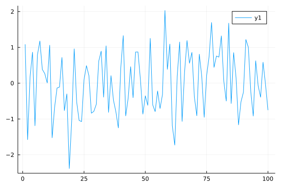
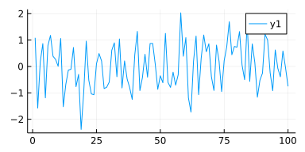

# Introduction

This a sample [Julia](http://julialang.org/) markdown document that can
be executed using [Weave.jl](https://github.com/JunoLab/Weave.jl).

The code is delimited from docs using markdown fenced code blocks
markup. 

You can create markdown output or pdf (with xelatex) and HTML directly using
the weave command as follows:


```julia
julia> a = sum(rand(100))
44.90981244109621
```


The value of a is 44.90981244109621.


```julia
using Weave
#Markdown
weave("example_jmd.jmd", out_path="output/", doctype="github")
#HTML
weave("example_jmd.jmd", out_path="output/", doctype="md2html")
#pdf
weave("example_jmd.jmd", out_path="output/", doctype="md2pdf")
```


# Chunk Options

You can use chunk options to configure how each chunk is evaluated, rendered, etc.
Most of the ideas came from [chunk options in RMarkdown](http://yihui.name/knitr/options).


## Syntax

Chunk options come after code chunk header.
There are two (slightly) different syntax to write them:
- (Julia's toplevel expression) options are separated by semicolon (`;`)
- (RMarkdown style) options are separated by comma (`,`)

Let's take a look at examples. All the following code chunk header are valid,
and so configured to hide the source code from generated output (`echo = false`)
and displays figures with 12cm width (`out_width = "12cm"`):
```md
 ```julia; echo = false; out_width = "12cm"

 ```{julia; echo = false; out_width = "12cm"}

 ```julia, echo = false, out_width = "12cm"

 ```{julia, echo = false, out_width = "12cm"}
```

## Weave Chunk Options

Weave currently supports the following chunk options:
we've mostly followed [RMarkdown's namings](http://yihui.name/knitr/options), but not all options are implemented.

### Evaluation

- `eval = true`: Evaluate the code chunk. If `false` the chunk won’t be executed.
- `error = true`: If `true`, `weave` won't stop on errors and rather they will be included in output document. If `false`, `weave` will halt on any of un-caught errors.
- `cache = false`: Cache results, depending on `cache` parameter on `weave` function.
- `tangle = true`: Set tangle to `false` to exclude chunk from tangled code.

### Rendering

- `echo = true`: Echo the code in the output document. If `false` the source code will be hidden.
- `results = "markup"`: The output format of the printed results. `"markup"` for literal block, `"hidden"` for hidden results, or anything else for raw output (I tend to use `"tex"` for Latex and `"rst"` for rest). Raw output is useful if you want to e.g. create tables from code chunks.
- `term = false`: If `true` the output emulates a REPL session. Otherwise only stdout and figures will be included in output.
- `wrap = true`: Wrap long lines from output.
- `line_width = 75`: Line width for wrapped lines.
- `hold = false`: Hold all results until the end of the chunk.

### Figures

- `label = nothing`: Chunk label, will be used for figure labels in Latex as `fig:label`.
- `fig_width = 6`: Figure width passed to plotting library.
- `fig_height = 4`: Figure height passed to plotting library.
- `out_width`: Width of saved figure in output markup e.g. `"50%"`, `"12cm"`, `0.5\linewidth`
- `out_height`: Height of saved figure in output markup
- `dpi = 96`: Resolution of saved figures.
- `fig_cap`: Figure caption.
- `fig_ext`: File extension (format) of saved figures.
- `fig_pos = "!h"`: Figure position in Latex, e.g.: `"ht"`.
- `fig_env = "figure"`: Figure environment in Latex.

# Header Configuration

When `weave`ing a markdown document, you use YAML header to provide additional metadata and configuration options.
A YAML header should be in the beginning of the input document delimited with `---`.

## Document Metadata

You can set additional document metadata in YAML header.
When `weave`ing to Julia markdown documents to HTML or PDF, Weave respects the following metadata specification:
- `title`
- `author`
- `date`

An example:
```yaml
---
title : Header Example
author : Shuhei Kadowaki
date: 16th May 2020
---
```

!!! note
    You can also have other metadata, but they won't appear in the resulting HTML and PDF.
    If you weave to Julia markdown to GitHub/Hugo markdown, all the metadata will be preserved.

### Dynamic Metadata

The metadata can be given "dynamically"; if you have inline code within YAML header, they will be evaluated _after_ evaluating all the chunks and replaced with the results.

The example document below will set `date` metadata dynamically.
Note that `Date` is available since the chunk is evaluated first.
````md
 ---
 title : Header Example
 author : Shuhei Kadowaki
 date: 2022-03-07
 ---

 ```julia; echo = false
 using Dates
 ```
````

## Configuration Options

Each of keyword arguments of [`weave`](@ref) can be set in the YAML header under `options` field.
You can also set [Chunks Options](@ref) there that will be applied globally.

The example below sets `out_path` and `doctype` options and overwrites `term` and `wrap` chunk options:
```yaml
---
title : Header Example
author : Shuhei Kadowaki
date: 16th May 2020
weave_options:
  out_path: relative/path/to/this/document
  doctype: github
  term: true
  wrap: false
---
```

!!! note
    - configurations specified within the YAML header have higher precedence than those specified via `weave` keyword arguments
    - chunk options specified within each chunk have higher precedence than the global global chunk options specified within the YAML header

!!! warning
    As opposed to metadata, _most_ of those configuration options can't be given dynamically (i.e. can't be via inline code),
    since they are needed for evaluation of chunks themselves.
    But some configuration options that are needed "formatting" document can still be given dynamically:
    - `template`
    - `css`
    - `highlight_theme`
    - `pandoc_options`
    - `latex_cmd`
    - `keep_unicode`

## Format Specific Options

The header configurations can be format specific.
Here is how to set different `out_path` for `md2html` and `md2pdf` and set `fig_ext` globally:
```yaml
---
weave_options:
  md2html:
    out_path : html
  md2pdf:
    out_path : pdf
  fig_ext : .png
---
```

<!-- this setup dependencies, but doesn't appear in the generated document -->


## Some useful commands in Julia REPL:

- ? (enters help mode);
- ; (enters system shell mode);
- ] (enters package manager mode);
- Ctrl-c (interrupts computations);
- Ctrl-d (exits Julia);
- Ctrl-l clears screen;
- putting ; after the expression will disable showing its value in REPL.

## Examples of some essential functions:

Loops and comprehensions rebind variables on each iteration, so they are 
safe to use then creating closures in iteration:
```julia
julia> Fs = Array{Any}(undef, 2)
2-element Vector{Any}:
 #undef
 #undef

julia> for i in 1:2
           Fs[i] = () -> i
       end

julia> Fs[1](), Fs[2]() # (1, 2)
(1, 2)
```


You can also control the way the results are captured, plot size etc.
using chunk options. Here is an example of a chunk that behaves like a repl.

```julia
julia> x = 1:10
1:10

julia> d = Dict("Weave" => "testing")
Dict{String, String} with 1 entry:
  "Weave" => "testing"

julia> y = [2, 4 ,8]
3-element Vector{Int64}:
 2
 4
 8
```


## Plotting
There are several plotting packages for Julia like Plots.jl (which is
an umbrella packages for several plotting backends). Here we show how to use it
(version 1.13.2):
```julia
julia> using Plots

julia> using Random

julia> Random.seed!(1) # make the plot reproducible
TaskLocalRNG()

julia> x, y = 1:100, randn(100)
(1:100, [1.0857940215432762, -1.5765649225859841, 0.1759399913010747, 0.8653808054093252, -1.1886800049871964, 0.7878269862203976, 1.1780259137155593, 0.3855116016279269, 0.26751404691066, 0.0073860677115008865  …  1.219317449444866, 1.0026816589160366, -0.23882187003406924, -0.9176728852666434, 0.6258646186564968, -0.0693870114225401, -0.3915200830436959, 0.5844124189902179, -0.03131594785999865, -0.7531338971077326])

julia> plot(x, y) # line plot
```



You can also for instance hide the code and show only the figure, add a
caption to the figure and make it wider as follows (you can only see the
syntax from the source document):




## Working with tabular data

There are multiple packages supporting tabular data for the Julia language.
Here we will show how DataFrames.jl package can be used.
```julia
julia> using DataFrames

julia> df = DataFrame(x=y, y=y)
100×2 DataFrame
 Row │ x            y
     │ Float64      Float64
─────┼──────────────────────────
   1 │  1.08579      1.08579
   2 │ -1.57656     -1.57656
   3 │  0.17594      0.17594
   4 │  0.865381     0.865381
   5 │ -1.18868     -1.18868
   6 │  0.787827     0.787827
   7 │  1.17803      1.17803
   8 │  0.385512     0.385512
  ⋮  │      ⋮            ⋮
  94 │ -0.917673    -0.917673
  95 │  0.625865     0.625865
  96 │ -0.069387    -0.069387
  97 │ -0.39152     -0.39152
  98 │  0.584412     0.584412
  99 │ -0.0313159   -0.0313159
 100 │ -0.753134    -0.753134
                 85 rows omitted

julia> first(df, 5)
5×2 DataFrame
 Row │ x          y
     │ Float64    Float64
─────┼──────────────────────
   1 │  1.08579    1.08579
   2 │ -1.57656   -1.57656
   3 │  0.17594    0.17594
   4 │  0.865381   0.865381
   5 │ -1.18868   -1.18868
```


The code is delimited from docs using markdown fenced code blocks
markup. 

You can create markdown output or pdf (with xelatex) and HTML directly using
the weave command as follows:

