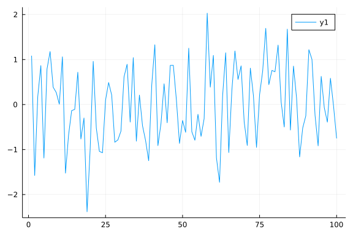
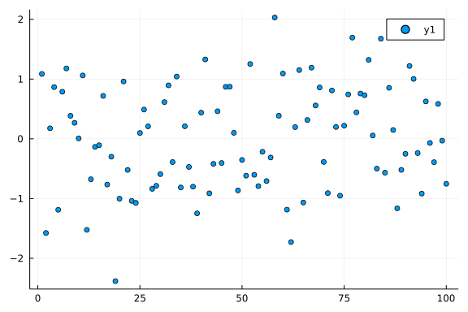
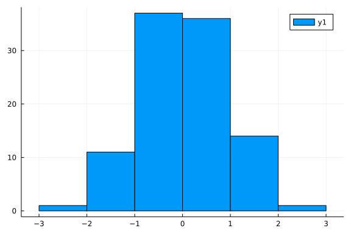

# Introduction
HaiYing Wang, at 2022-02-13


This an example of a julia script that can be published using
[Weave](http://weavejl.mpastell.com/dev/usage/).
The script can be executed normally using Julia
or published to HTML or pdf with Weave.
Text is written in markdown in lines starting with "`#'` " and code
is executed and results are included in the published document.


You can create HTML or pdf file using the weave command as follows:
```julia
using Weave
#HTML
weave("example_note01.jl", out_path="output/")
#pdf
weave("example_note01.jl", out_path="output/", doctype="md2pdf")
```


Chunk Options can be specified using a line starting with "`#+`".
```julia
#+ eval=false; echo = false; term=true; 
rand(10, 5)
```


<!--
using Pkg
"Plots" ∉ keys(Pkg.project().dependencies) && Pkg.add("Plots");
"DataFrames" ∉ keys(Pkg.project().dependencies) && Pkg.add("DataFrames");
## The Joy of Julia
-->


## Some useful commands in Julia REPL:


- ? (enters help mode);
- ; (enters system shell mode);
- ] (enters package manager mode);
- Ctrl-c (interrupts computations);
- Ctrl-d (exits Julia);
- Ctrl-l clears screen;
- putting ; after the expression will disable showing its value in REPL.


## Examples of some essential functions:


Loops and comprehensions rebind variables on each iteration, so they are 
safe to use then creating closures in iteration:

```julia
julia> Fs = Array{Any}(undef, 2)
2-element Vector{Any}:
 #undef
 #undef

julia> for i in 1:2
           Fs[i] = () -> i
       end

julia> Fs[1](), Fs[2]() # (1, 2)
(1, 2)
```


## Plotting
There are several plotting packages for Julia like Plots.jl (which is
an umbrella packages for several plotting backends). Here we show how to use it
(version 1.13.2):

```julia
julia> using Plots

julia> using Random

julia> Random.seed!(1) # make the plot reproducible
Random.TaskLocalRNG()

julia> x, y = 1:100, randn(100)
(1:100, [1.0857940215432762, -1.5765649225859841, 0.1759399913010747, 0.8653808054093252, -1.1886800049871964, 0.7878269862203976, 1.1780259137155593, 0.3855116016279269, 0.26751404691066, 0.0073860677115008865  …  1.219317449444866, 1.0026816589160366, -0.23882187003406924, -0.9176728852666434, 0.6258646186564968, -0.0693870114225401, -0.3915200830436959, 0.5844124189902179, -0.03131594785999865, -0.7531338971077326])

julia> plot(x, y) # line plot
```


```julia
julia> scatter(x, y) # scatter plot
```


```julia
julia> histogram(y)
```



## Working with tabular data


There are multiple packages supporting tabular data for the Julia language.
Here we will show how DataFrames.jl package can be used.

```julia
julia> using DataFrames

julia> df = DataFrame(x=y, y=y)
100×2 DataFrame
 Row │ x            y
     │ Float64      Float64
─────┼──────────────────────────
   1 │  1.08579      1.08579
   2 │ -1.57656     -1.57656
   3 │  0.17594      0.17594
   4 │  0.865381     0.865381
   5 │ -1.18868     -1.18868
   6 │  0.787827     0.787827
   7 │  1.17803      1.17803
   8 │  0.385512     0.385512
  ⋮  │      ⋮            ⋮
  94 │ -0.917673    -0.917673
  95 │  0.625865     0.625865
  96 │ -0.069387    -0.069387
  97 │ -0.39152     -0.39152
  98 │  0.584412     0.584412
  99 │ -0.0313159   -0.0313159
 100 │ -0.753134    -0.753134
                 85 rows omitted

julia> first(df, 5)
5×2 DataFrame
 Row │ x          y
     │ Float64    Float64
─────┼──────────────────────
   1 │  1.08579    1.08579
   2 │ -1.57656   -1.57656
   3 │  0.17594    0.17594
   4 │  0.865381   0.865381
   5 │ -1.18868   -1.18868
```

