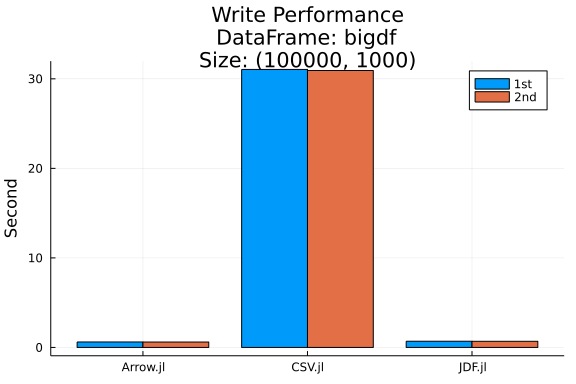
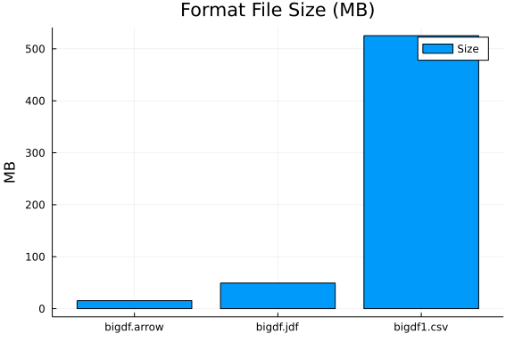
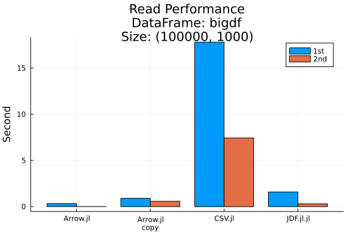

```julia
julia> using DataFrames
```

## Load and save DataFrames
Here we'll load CSV.jl to read and write CSV files, and demonstrate Arrow.jl and JDF.jl for therir specific formats.

```julia
julia> using Arrow, CSV, JDF

julia> using StatsPlots # for charts
```


Let's create a simple `DataFrame` for testing purposes,

```julia
julia> x = DataFrame(A=[true, false, true], B=[1, 2, missing],
                      C=[missing, "b", "c"], D=['a', missing, 'c'])
3×4 DataFrame
 Row │ A      B        C        D
     │ Bool   Int64?   String?  Char?
─────┼──────────────────────────────────
   1 │  true        1  missing  a
   2 │ false        2  b        missing
   3 │  true  missing  c        c
```


### CSV.jl
Let's use `CSV` to save `x` to disk.

```julia
julia> CSV.write("x1.csv", x)
"x1.csv"
```


Now we can see how it was saved by reading `x.csv`.

```julia
julia> print(read("x1.csv", String))
A,B,C,D
true,1,,a
false,2,b,
true,,c,c
```


We can also load it back.

```julia
julia> y = CSV.read("x1.csv", DataFrame)
3×4 DataFrame
 Row │ A      B        C         D
     │ Bool   Int64?   String1?  String1?
─────┼────────────────────────────────────
   1 │  true        1  missing   a
   2 │ false        2  b         missing
   3 │  true  missing  c         c
```


Note that when loading in a `DataFrame` from a `CSV` the column type for column `:D` has changed!

```julia
julia> eltype.(eachcol(y))
4-element Vector{Type}:
 Bool
 Union{Missing, Int64}
 Union{Missing, String1}
 Union{Missing, String1}
```


### JDF.jl
[JDF.jl](https://github.com/xiaodaigh/JDF) is a relatively new package designed to serialize DataFrames. You can save a DataFrame with the `savejdf` function.

```julia
julia> JDF.save("x.jdf", x)
JDFFile{String}("x.jdf")
```


To load the saved JDF file, one can use the `loadjdf` function

```julia
julia> x_loaded = JDF.load("x.jdf") |> DataFrame
3×4 DataFrame
 Row │ A      B        C        D
     │ Bool   Int64?   String?  Char?
─────┼──────────────────────────────────
   1 │  true        1  missing  a
   2 │ false        2  b        missing
   3 │  true  missing  c        c

julia> x_loaded = DataFrame(JDF.load("x.jdf"))
3×4 DataFrame
 Row │ A      B        C        D
     │ Bool   Int64?   String?  Char?
─────┼──────────────────────────────────
   1 │  true        1  missing  a
   2 │ false        2  b        missing
   3 │  true  missing  c        c
```


You can see that they are the same

```julia
julia> isequal(x_loaded, x)
true
```


JDF.jl offers the ability to load only certain columns from disk to help with working with large files.

```julia
julia> # Set up a JDFFile which is a on disk representation of `x` backed by JDF.jl
       x_ondisk = jdf"x.jdf"
JDFFile{String}("x.jdf")
```


We can see all the names of `x` without loading it into memory

```julia
julia> names(x_ondisk)
4-element Vector{Symbol}:
 :A
 :B
 :C
 :D
```


The below is an example of how to load only columns `:A` and `:D` 

```julia
julia> xd = JDF.load(x_ondisk; cols = ["A", "D"]) |> DataFrame
3×2 DataFrame
 Row │ A      D
     │ Bool   Char?
─────┼────────────────
   1 │  true  a
   2 │ false  missing
   3 │  true  c
```


### Arrow.jl
Finally we use Apache Arrow format that allows, in particular, for data interchange with R or Python.

```julia
julia> Arrow.write("x.arrow", x)
"x.arrow"

julia> y = Arrow.Table("x.arrow") |> DataFrame
3×4 DataFrame
 Row │ A      B        C        D
     │ Bool   Int64?   String?  Char?
─────┼──────────────────────────────────
   1 │  true        1  missing  a
   2 │ false        2  b        missing
   3 │  true  missing  c        c

julia> eltype.(eachcol(y))
4-element Vector{Type}:
 Bool
 Union{Missing, Int64}
 Union{Missing, String}
 Union{Missing, Char}
```


Note that columns of `y` are immutable

```julia
julia> y.A[1] = false
Error: ReadOnlyMemoryError()
```


This is because `Arrow.Table` uses memory mapping and thus uses a custom vector types:

```julia
julia> y.A
3-element Arrow.BoolVector{Bool}:
 1
 0
 1

julia> y.B
3-element Arrow.Primitive{Union{Missing, Int64}, Vector{Int64}}:
 1
 2
  missing
```


You can get standard Julia Base vectors by copying a data frame

```julia
julia> y2 = copy(y)
3×4 DataFrame
 Row │ A      B        C        D
     │ Bool   Int64?   String?  Char?
─────┼──────────────────────────────────
   1 │  true        1  missing  a
   2 │ false        2  b        missing
   3 │  true  missing  c        c

julia> y2.A
3-element Vector{Bool}:
 1
 0
 1

julia> y2.B
3-element Vector{Union{Missing, Int64}}:
 1
 2
  missing

julia> y2.A[1] = false
false
```


### Basic bechmarking
Next, we'll create some files, so be careful that you don't already have these files in your working directory!
In particular, we'll time how long it takes us to write a `DataFrame` with 10^3 rows and 10^5 columns.

```julia
julia> bigdf = DataFrame(rand(Bool, 10^5, 1000), :auto)
100000×1000 DataFrame
    Row │ x1     x2     x3     x4     x5     x6     x7     x8     x9     x10   ⋯
        │ Bool   Bool   Bool   Bool   Bool   Bool   Bool   Bool   Bool   Bool  ⋯
────────┼───────────────────────────────────────────────────────────────────────
      1 │  true   true   true   true  false  false  false  false   true  false ⋯
      2 │ false  false  false  false  false  false   true  false  false  false
      3 │ false  false  false   true  false   true  false  false  false  false
      4 │ false   true   true  false  false   true   true   true   true   true
      5 │  true  false  false   true   true  false  false  false   true  false ⋯
      6 │  true  false  false   true   true   true   true  false   true  false
      7 │ false  false   true  false   true  false  false   true   true   true
      8 │  true  false  false  false   true   true   true  false  false  false
   ⋮    │   ⋮      ⋮      ⋮      ⋮      ⋮      ⋮      ⋮      ⋮      ⋮      ⋮   ⋱
  99994 │ false  false   true   true   true  false   true  false  false  false ⋯
  99995 │ false   true  false   true  false   true  false  false  false  false
  99996 │ false   true   true  false  false   true  false  false   true   true
  99997 │ false  false  false  false   true  false  false  false  false   true
  99998 │ false   true   true   true   true  false   true   true   true   true ⋯
  99999 │ false  false  false   true  false  false  false  false   true  false
 100000 │  true   true   true  false  false  false  false   true  false   true
                                              990 columns and 99985 rows omitted

julia> bigdf[!, 1] = Int.(bigdf[!, 1])
100000-element Vector{Int64}:
 1
 0
 0
 0
 1
 1
 0
 1
 0
 1
 ⋮
 1
 1
 0
 0
 0
 0
 0
 0
 1

julia> bigdf[!, 2] = bigdf[!, 2] .+ 0.5
100000-element Vector{Float64}:
 1.5
 0.5
 0.5
 1.5
 0.5
 0.5
 0.5
 0.5
 1.5
 0.5
 ⋮
 1.5
 1.5
 0.5
 1.5
 1.5
 0.5
 1.5
 0.5
 1.5

julia> bigdf[!, 3] = string.(bigdf[!, 3], ", as string")
100000-element Vector{String}:
 "true, as string"
 "false, as string"
 "false, as string"
 "true, as string"
 "false, as string"
 "false, as string"
 "true, as string"
 "false, as string"
 "false, as string"
 "false, as string"
 ⋮
 "true, as string"
 "false, as string"
 "true, as string"
 "false, as string"
 "true, as string"
 "false, as string"
 "true, as string"
 "false, as string"
 "true, as string"

julia> println("First run")
First run

julia> csvwrite1 = @elapsed @time CSV.write("bigdf1.csv", bigdf)
 31.044180 seconds (597.48 M allocations: 17.848 GiB, 4.98% gc time)
31.044569682

julia> jdfwrite1 = @elapsed @time JDF.save("bigdf.jdf", bigdf)
  0.689606 seconds (31.15 k allocations: 321.110 MiB)
0.689751937

julia> arrowwrite1 = @elapsed @time Arrow.write("bigdf.arrow", bigdf)
  0.608480 seconds (52.15 k allocations: 20.765 MiB)
0.608588669

julia> println("Second run")
Second run

julia> csvwrite2 = @elapsed @time CSV.write("bigdf1.csv", bigdf)
 30.927732 seconds (597.48 M allocations: 17.848 GiB, 4.91% gc time)
30.928099341

julia> jdfwrite2 = @elapsed @time JDF.save("bigdf.jdf", bigdf)
  0.681091 seconds (31.15 k allocations: 321.110 MiB)
0.68120057

julia> arrowwrite2 = @elapsed @time Arrow.write("bigdf.arrow", bigdf)
  0.605440 seconds (52.15 k allocations: 20.765 MiB)
0.605597908

julia> groupedbar(
           repeat(["CSV.jl", "JDF.jl", "Arrow.jl"], inner = 2),
           [csvwrite1, csvwrite2, jdfwrite1, jdfwrite2, arrowwrite1, arrowwrite2],
           group = repeat(["1st", "2nd"], outer = 3),
           ylab = "Second",
           title = "Write Performance\nDataFrame: bigdf\nSize: $(size(bigdf))"
       )
```


```julia
julia> data_files = ["bigdf1.csv", "bigdf.arrow"]
2-element Vector{String}:
 "bigdf1.csv"
 "bigdf.arrow"

julia> df = DataFrame(file = data_files, size = getfield.(stat.(data_files), :size))
2×2 DataFrame
 Row │ file         size
     │ String       Int64
─────┼────────────────────────
   1 │ bigdf1.csv   550800856
   2 │ bigdf.arrow   16152346

julia> append!(df, DataFrame(file = "bigdf.jdf",
                             size=reduce((x,y)->x+y.size,
                                         stat.(joinpath.("bigdf.jdf",
                                                      readdir("bigdf.jdf"))), init=0)))
3×2 DataFrame
 Row │ file         size
     │ String       Int64
─────┼────────────────────────
   1 │ bigdf1.csv   550800856
   2 │ bigdf.arrow   16152346
   3 │ bigdf.jdf     51704664

julia> sort!(df, :size)
3×2 DataFrame
 Row │ file         size
     │ String       Int64
─────┼────────────────────────
   1 │ bigdf.arrow   16152346
   2 │ bigdf.jdf     51704664
   3 │ bigdf1.csv   550800856

julia> @df df plot(:file, :size/1024^2, seriestype=:bar,
                   title = "Format File Size (MB)", label="Size", ylab="MB")
```


```julia
julia> println("First run")
First run

julia> csvread1 = @elapsed @time CSV.read("bigdf1.csv", DataFrame)
 17.799845 seconds (407.05 M allocations: 17.082 GiB, 81.13% gc time, 56.17% compilation time)
17.799947965

julia> jdfread1 = @elapsed @time JDF.load("bigdf.jdf") |> DataFrame
  1.582627 seconds (338.81 k allocations: 328.705 MiB, 85.71% compilation time)
1.582711901

julia> arrowread1 = @elapsed @time df_tmp = Arrow.Table("bigdf.arrow") |> DataFrame
  0.328661 seconds (490.44 k allocations: 26.201 MiB, 98.25% compilation time)
0.328753887

julia> arrowread1copy = @elapsed @time copy(df_tmp)
  0.571198 seconds (103.50 k allocations: 101.337 MiB)
0.571334778

julia> println("Second run")
Second run

julia> csvread2 = @elapsed @time CSV.read("bigdf1.csv", DataFrame)
  7.434860 seconds (400.23 M allocations: 16.704 GiB, 78.12% gc time, 0.09% compilation time)
7.434973342

julia> jdfread2 = @elapsed @time JDF.load("bigdf.jdf") |> DataFrame
  0.299819 seconds (77.25 k allocations: 316.314 MiB)
0.299963916

julia> arrowread2 = @elapsed @time df_tmp = Arrow.Table("bigdf.arrow") |> DataFrame
  0.004609 seconds (68.52 k allocations: 3.344 MiB)
0.004699122

julia> arrowread2copy = @elapsed @time copy(df_tmp)
  0.575229 seconds (103.50 k allocations: 101.337 MiB)
0.575362749

julia> groupedbar(
           repeat(["CSV.jl", "JDF.jl.jl", "Arrow.jl", "Arrow.jl\ncopy"], inner = 2),
           [csvread1, csvread2, jdfread1, jdfread2, arrowread1, arrowread2, arrowread1+arrowread1copy, arrowread2+arrowread2copy],    
           group = repeat(["1st", "2nd"], outer = 4),
           ylab = "Second",
           title = "Read Performance\nDataFrame: bigdf\nSize: $(size(bigdf))"
       )
```


