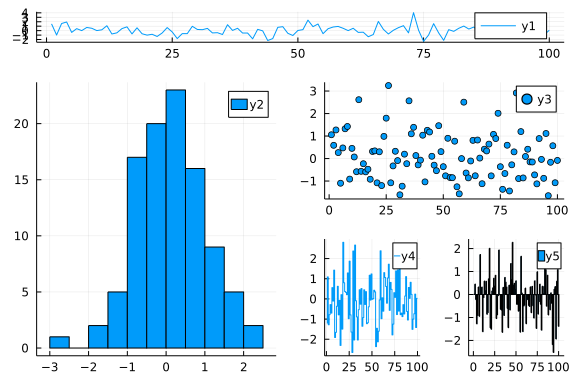
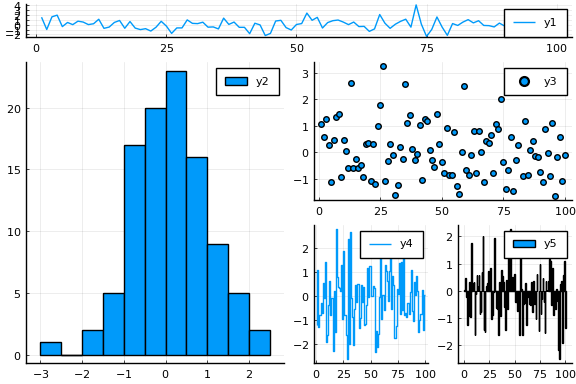
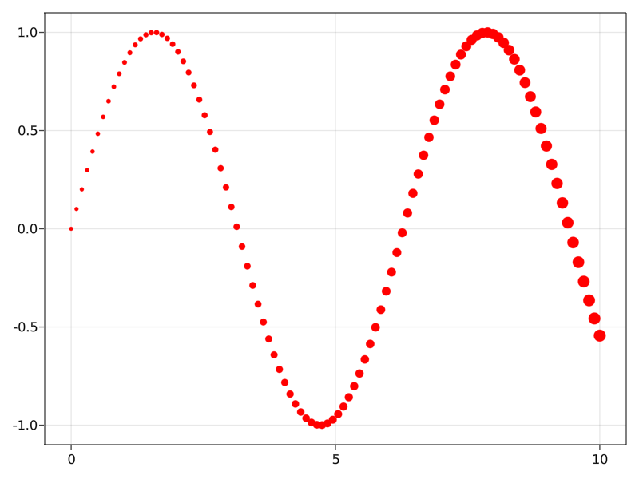
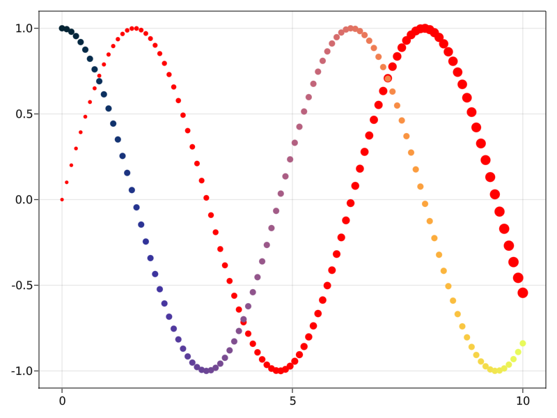

# [Data visualization in Julia](https://github.com/JuliaPlots)

## [Plots.jl](https://docs.juliaplots.org)

Plots is a visualization interface and toolset. It sits above other backends, like GR, PyPlot, PGFPlotsX, or Plotly, connecting commands with implementation. If one backend does not support your desired features or make the right trade-offs, you can just switch to another backend with one command. No need to change your code. No need to learn a new syntax.

The goals with the package are:

- **Powerful**.  Do more with less. Complex visualizations become easy.
- **Intuitive**.  Start generating plots without reading volumes of documentation. Commands should "just work."
- **Concise**.  Less code means fewer mistakes and more efficient development and analysis.
- **Flexible**.  Produce your favorite plots from your favorite package, only quicker and simpler.
- **Consistent**. Don't commit to one graphics package. Use the same code and access the strengths of all backends.
- **Lightweight**.  Very few dependencies, since backends are loaded and initialized dynamically.
- **Smart**.  It's not quite AGI, but Plots should figure out what you **want** it to do... not just what you **tell** it.

### [Backends](https://docs.juliaplots.org/latest/backends/)

Backends are the lifeblood of Plots, and the diversity between features, approaches, and strengths/weaknesses was
one of the primary reasons of this package.

#### At a glance

My favorites: GR for speed, Plotly(JS) for interactivity, PyPlot otherwise.

| If you require...         | ... then use...                 |
| ------------------------- | ------------------------------- |
| features                  | PyPlot, Plotly(JS), GR          |
| speed                     | GR, InspectDR, Gaston           |
| interactivity             | Plotly(JS), PyPlot, InspectDR   |
| beauty                    | Plotly(JS), PGFPlots/ PGFPlotsX |
| REPL Plotting             | UnicodePlots                    |
| 3D plots                  | PyPlot, GR, Plotly(JS), Gaston  |
| a GUI Window              | GR, PyPlot, PlotlyJS, InspectDR |
| a small footprint         | UnicodePlots, Plotly            |
| backend stability         | Gaston                          |
| plot+data -> `.hdf5` file | HDF5                            |

Of course nothing in life is that simple.  Likely there are subtle tradeoffs between backends, long hidden bugs, and more excitement.  Don't be shy to try out something new!

---

#### [GR](https://github.com/jheinen/GR.jl)

Super fast with lots of plot types. Still actively developed and improving daily.

```julia
julia> using Plots

julia> gr() # GR is the default, so you may not need this line
Plots.GRBackend()

julia> dat = randn(100, 5);

julia> p=plot(dat, layout=@layout([a{0.1h}; b [c; d e]]), t=[:line :histogram :scatter :steppre :bar])
```



```julia
julia> savefig(p, "plotgrexample.pdf")
```

Pros:

- Speed
- 2D and 3D
- Standalone or inline

Cons:

- Limited interactivity

#### [Plotly / PlotlyJS](https://github.com/spencerlyon2/PlotlyJS.jl)

These are treated as separate backends, though they share much of the code and use the Plotly javascript API.  `plotly()` is the only dependency-free plotting option,
as the required javascript is bundled with Plots.  It can create inline plots in IJulia, or open standalone browser windows when run from the Julia REPL.

`plotlyjs()` is the preferred option, and taps into the great functionality of Spencer Lyon's PlotlyJS.jl.  Inline IJulia plots can be updated from any cell... something that
makes this backend stand out.  From the Julia REPL, it taps into Blink.jl and Electron to plot within a standalone GUI window... also very cool. Also, PlotlyJS supports saving the output to more formats than Plotly, such as EPS and PDF, and thus is the recommended version of Plotly for developing publication-quality figures.

```julia
using ElectronDisplay; ElectronDisplay.CONFIG.focus = false
using Plots
plotlyjs() # need to install the PlotlyJS package: `import Pkg; Pkg.add("PlotlyJS")`
plot(dat, layout=@layout([a{0.1h}; b [c; d e]]), t=[:line :histogram :scatter :steppre :bar])
savefig("plotlyjsexample.html")
savefig("plotlyjsexample.pdf")
```

Pros:

- [Tons of functionality](https://plot.ly/javascript/)
- 2D and 3D
- Mature library
- Interactivity (even when inline)
- Standalone or inline

Cons:

- No custom shapes
- JSON may limit performance

#### [PyPlot](https://github.com/stevengj/PyPlot.jl)

A Julia wrapper around the popular python package PyPlot (Matplotlib).  It uses PyCall.jl to pass data with minimal overhead.

```julia
julia> using Plots

julia> pyplot() # install the package `import Pkg; Pkg.add("PyPlot")`
Plots.PyPlotBackend()

julia> plot(dat, layout=@layout([a{0.1h}; b [c; d e]]), t=[:line :histogram :scatter :steppre :bar])
```



Pros:

- Tons of functionality
- 2D and 3D
- Mature library
- Standalone or inline
- Well supported in Plots

Cons:

- Uses python
- Dependencies frequently cause setup issues

```julia
import Pkg; Pkg.add("PyPlot")
# After this, install the Python matplotlib module in terminal: 
# pip install matplotlib
# restart julia fot it to work
# - Sometime the following code helps
ENV["PYTHON"]=""
import Pkg
Pkg.build("PyCall")
```

#### [UnicodePlots](https://github.com/JuliaPlots/UnicodePlots.jl)

Simple and lightweight.  Plot directly in your terminal.  You won't produce anything publication quality, but for a quick look at your data it is awesome.

```julia
julia> unicodeplots() # install the package: `import Pkg; Pkg.add("UnicodePlots")`
Plots.UnicodePlotsBackend()

julia> plot([sin cos])
           ┌────────────────────────────────────────┐   
   1.05999 │⠀⠴⠲⢄⠀⠀⠀⠀⠀⠀⠀⠀⠀⠀⠀⠀⠀⠀⢠⠔⡷⡀⠀⠀⣠⠖⠢⡄⠀⠀⠀⠀⠀⠀⠀⠀⠀⠀⠀⠀│ y1
           │⠀⠀⠀⠈⢦⠀⠀⠀⠀⠀⠀⠀⠀⠀⠀⠀⠀⣰⠃⠀⡇⠘⡆⣰⠃⠀⠀⠘⡄⠀⠀⠀⠀⠀⠀⠀⠀⠀⠀⠀│ y2
           │⠀⠀⠀⠀⠈⡆⠀⠀⠀⠀⠀⠀⠀⠀⠀⠀⢠⠃⠀⠀⡇⠀⢸⡇⠀⠀⠀⠀⠸⡀⠀⠀⠀⠀⠀⠀⠀⠀⠀⠀│   
           │⠀⠀⠀⠀⠀⠸⡀⠀⠀⠀⠀⠀⠀⠀⠀⠀⡎⠀⠀⠀⡇⠀⡎⢱⠀⠀⠀⠀⠀⢱⠀⠀⠀⠀⠀⠀⠀⠀⠀⠀│   
           │⠀⠀⠀⠀⠀⠀⢣⠀⠀⠀⠀⠀⠀⠀⠀⡸⠀⠀⠀⠀⡇⢸⠀⠀⡇⠀⠀⠀⠀⠈⡆⠀⠀⠀⠀⠀⠀⠀⠀⠀│   
           │⠀⡆⠀⠀⠀⠀⠘⡄⠀⠀⠀⠀⠀⠀⠀⡇⠀⠀⠀⠀⣇⠇⠀⠀⠸⡀⠀⠀⠀⠀⠸⡀⠀⠀⠀⠀⠀⠀⢠⠀│   
           │⠀⢸⠀⠀⠀⠀⠀⢱⠀⠀⠀⠀⠀⠀⡸⠀⠀⠀⠀⠀⡟⠀⠀⠀⠀⢇⠀⠀⠀⠀⠀⢇⠀⠀⠀⠀⠀⠀⡏⠀│   
           │⠒⠒⡗⠒⠒⠒⠒⠚⡗⠒⠒⠒⠒⢒⠗⠒⠒⠒⠒⢲⡗⠒⠒⠒⠒⠚⡖⠒⠒⠒⠒⠺⡒⠒⠒⠒⠒⢺⠒⠒│   
           │⠀⠀⢸⠀⠀⠀⠀⠀⢸⠀⠀⠀⠀⡜⠀⠀⠀⠀⠀⡜⡇⠀⠀⠀⠀⠀⢧⠀⠀⠀⠀⠀⢇⠀⠀⠀⠀⡇⠀⠀│   
           │⠀⠀⠀⢇⠀⠀⠀⠀⠀⡇⠀⠀⢠⠃⠀⠀⠀⠀⢠⠃⡇⠀⠀⠀⠀⠀⠘⡄⠀⠀⠀⠀⠸⡀⠀⠀⡸⠀⠀⠀│   
           │⠀⠀⠀⠸⡀⠀⠀⠀⠀⢸⠀⠀⡜⠀⠀⠀⠀⠀⡎⠀⡇⠀⠀⠀⠀⠀⠀⢳⠀⠀⠀⠀⠀⢣⠀⢀⠇⠀⠀⠀│   
           │⠀⠀⠀⠀⢇⠀⠀⠀⠀⠀⢧⢰⠁⠀⠀⠀⠀⡸⠀⠀⡇⠀⠀⠀⠀⠀⠀⠈⡆⠀⠀⠀⠀⠈⡆⡜⠀⠀⠀⠀│   
           │⠀⠀⠀⠀⠈⢆⠀⠀⠀⠀⢈⡇⠀⠀⠀⠀⢠⠃⠀⠀⡇⠀⠀⠀⠀⠀⠀⠀⠸⡄⠀⠀⠀⠀⡱⡁⠀⠀⠀⠀│   
           │⠀⠀⠀⠀⠀⠘⡄⠀⠀⢠⠎⠘⣄⠀⠀⢀⠏⠀⠀⠀⡇⠀⠀⠀⠀⠀⠀⠀⠀⠱⡀⠀⠀⣠⠃⢳⡀⠀⠀⠀│   
     -1.06 │⠀⠀⠀⠀⠀⠀⠈⠲⠴⠋⠀⠀⠈⠢⠴⠃⠀⠀⠀⠀⡇⠀⠀⠀⠀⠀⠀⠀⠀⠀⠙⠦⠖⠁⠀⠀⠑⠦⠖⠀│   
           └────────────────────────────────────────┘   
           ⠀-5.3⠀⠀⠀⠀⠀⠀⠀⠀⠀⠀⠀⠀⠀⠀⠀⠀⠀⠀⠀⠀⠀⠀⠀⠀⠀⠀⠀⠀⠀⠀⠀⠀⠀5.3⠀   
```

Pros:

- Minimal dependencies
- Lightweight
- Fast
- REPL plotting

Cons:

- Limited functionality

## [Gadfly.jl](http://gadflyjl.org/)

Gadfly is a system for plotting and visualization written in
[Julia](https://julialang.org). It is based largely on Hadley Wickhams's
[ggplot2](http://ggplot2.org/) for R and Leland Wilkinson's book [The
Grammar of
Graphics](http://www.cs.uic.edu/~wilkinson/TheGrammarOfGraphics/GOG.html).
It was [Daniel C. Jones'](https://github.com/dcjones) brainchild and is
now maintained by the community.
Please consider [citing
it](https://zenodo.org/record/1284282) if you use it in your work.

### Package features

- Renders publication quality graphics to SVG, PNG, Postscript, and PDF
- Intuitive and consistent plotting interface
- Works with [Jupyter](http://jupyter.org/) notebooks via [IJulia](https://github.com/JuliaLang/IJulia.jl) out of the box
- Tight integration with [DataFrames.jl](https://github.com/JuliaStats/DataFrames.jl)
- Interactivity like panning, zooming, toggling powered by [Snap.svg](http://snapsvg.io/)
- Supports a large number of common plot types

## [Makie.jl](https://makie.juliaplots.org/stable)

Makie is a data visualization ecosystem for the [Julia programming language](https://julialang.org), with high performance and extensibility. It is available for Windows, Mac and Linux.

```julia
julia> using GLMakie

julia> x = range(0, 10, length=100);

julia> y1 = sin.(x); y2 = cos.(x);

julia> GLMakie.scatter(x, y1, color = :red, markersize = range(5, 15, length=100))
```



```julia
julia> sc = GLMakie.scatter!(x, y2, color = range(0, 1, length=100), colormap = :thermal)
MakieCore.Scatter{Tuple{Vector{GeometryBasics.Point{2, Float32}}}}

julia> current_figure()
```



```julia
using GLMakie

Base.@kwdef mutable struct Lorenz
    dt::Float64 = 0.01
    σ::Float64 = 10
    ρ::Float64 = 28
    β::Float64 = 8/3
    x::Float64 = 1
    y::Float64 = 1
    z::Float64 = 1
end

function step!(l::Lorenz)
    dx = l.σ * (l.y - l.x)
    dy = l.x * (l.ρ - l.z) - l.y
    dz = l.x * l.y - l.β * l.z
    l.x += l.dt * dx
    l.y += l.dt * dy
    l.z += l.dt * dz
    Point3f(l.x, l.y, l.z)
end

attractor = Lorenz()

points = Observable(Point3f[])
colors = Observable(Int[])

set_theme!(theme_black())

fig, ax, l = lines(points, color = colors,
    colormap = :inferno, transparency = true,
    axis = (; type = Axis3, protrusions = (0, 0, 0, 0),
        viewmode = :fit, limits = (-30, 30, -30, 30, 0, 50)))

record(fig, "lorenz.mp4", 1:120) do frame
    for i in 1:50
        push!(points[], step!(attractor))
        push!(colors[], frame)
    end
    ax.azimuth[] = 1.7pi + 0.3 * sin(2pi * frame / 120)
    notify.((points, colors))
    l.colorrange = (0, frame)
end
```
