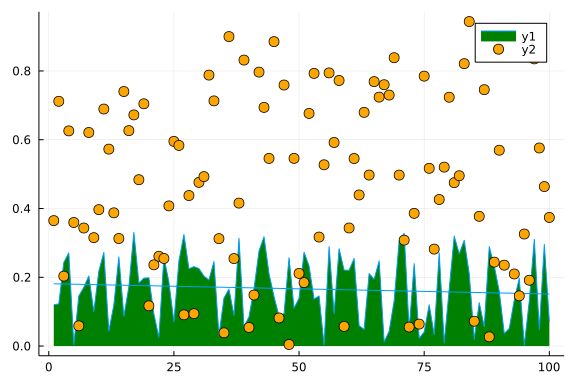
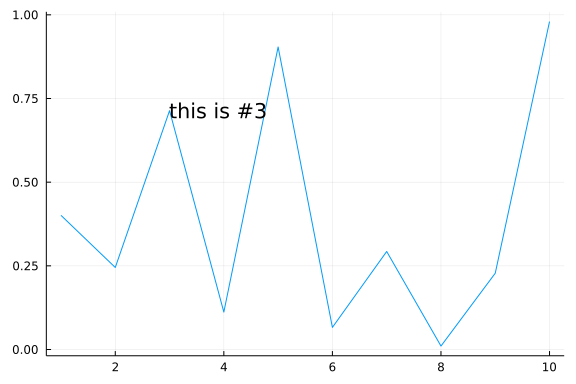
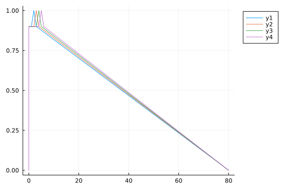
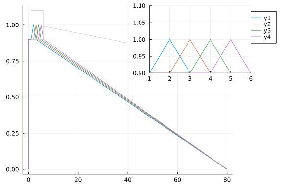

# Plots

## GR Examples

```julia
julia> using Plots
```

### Lines

A simple line plot of the columns.

```julia
julia> fdat = Plots.fakedata(50, 5);

julia> plot(fdat)
```


```julia
julia> plot(fdat, w = 3)
```


The option `w=3` specify the line width. Here are examples with other commonly used options.

```julia
julia> plot(fdat, title = "First figure", label = "Line " .* string.(collect(1:5)'),
            size = 1.2 .*(500, 300), lw = 3,
            # m=(3, :auto),
            markershape=[:circle :rect :star5 :diamond :utriangle],
            tickfontsize=12, xguidefontsize=12, yguidefontsize=12,
            legendfontsize=10, grid=true, thickness_scaling=1,
            xlabel="x1", ylabel="y", legend=:topright
            )
```


```julia
julia> # Possible markershape [:none, :auto, :circle, :rect, :star5, :diamond, :hexagon, :cross, :xcross, :utriangle, :dtriangle, :rtriangle, :ltriangle, :pentagon, :heptagon, :octagon, :star4, :star6, :star7, :star8, :vline, :hline, :+, :x].

       xlabel!("My x label")
```


```julia
julia> plot(fdat, ms=10, w=3, shape=:auto, c=:auto, ls=:auto)
```


```julia
julia> plot(collect(1:20)', ms=10, shape=:auto, c=:auto, ls=:auto)
```


### Functions, adding data, and animations

Plot multiple functions. You can also put the function first, or use the
form `plot(f, xmin, xmax)` where `f` is a Function or `AbstractVector{Function}`.

Get series data: `x, y = plt[i]`. Set series data: `plt[i] = (x,y)`. Add
to the series with `push!`/`append!`.

Easily build animations. (`convert` or `ffmpeg` must be available to
generate the animation.) Use command `gif(anim, filename, fps=15)` to
save the animation.

```julia
julia> p = plot([sin, cos], zeros(0), leg = false, xlims = (0, 2π), ylims = (-1, 1))
```


```julia
julia> anim = Animation()
Animation("/tmp/jl_ZpwkML", String[])

julia> for x = range(0, stop=2π, length=20)
           push!(p, x, Float64[sin(x), cos(x)])
           frame(anim)
       end

julia> gif(anim, "animation_example.gif", fps=20)
Plots.AnimatedGif("/home/ossifragus/Dropbox/teaching/5125/notes/note06_visualization/animation_example.gif")
```

### Parametric plots

Plot function pair (x(u), y(u)).

```julia
julia> plot(sin, x-> sin(2x), 0, 2π, line=4, legend=false, fill=(0, :orange))
```


### Colors

Access predefined palettes (or build your own with the `colorscheme`
method). Line/marker colors are auto-generated from the plot\'s palette,
unless overridden. Set the `z` argument to turn on series gradients.

```julia
julia> dat = rand(11, 4);

julia> plot(0:10:100, dat, w=3)
```


```julia
julia> plot(0:10:100, dat, w=3, α=0.5)
```


```julia
julia> plot(0:10:100, dat, w=3, fill=0, α=0.5)
```


```julia
julia> plot(0:10:100, dat, w=3, fill=0, α=0.5, palette=cgrad(:grays))
```


```julia
julia> y = rand(100);

julia> plot(y, seriestype=:scatter)
```


```julia
julia> scatter(y)
```


```julia
julia> scatter(y, zcolor = y)
```


```julia
julia> scatter(y, zcolor = abs.(y .- 0.5))
```


```julia
julia> scatter(y, zcolor = abs.(y .- 0.5), m = :star)
```


```julia
julia> scatter(y, zcolor = abs.(y .- 0.5), m = :star, ms = 10abs.(y .- 0.5) .+ 4)
```


### Global

Change the guides/background/limits/ticks. Convenience args `xaxis` and
`yaxis` allow you to pass a tuple or value which will be mapped to the
relevant args automatically. The `xaxis` below will be replaced with
`xlabel` and `xlims` args automatically during the preprocessing step.
You can also use shorthand functions: `title!`, `xaxis!`, `yaxis!`,
`xlabel!`, `ylabel!`, `xlims!`, `ylims!`, `xticks!`, `yticks!`

```julia
julia> using Statistics

julia> y = rand(20, 3); y[:,2] .+= 1; y[:,3] .+= 2;

julia> plot(y)
```


```julia
julia> plot(y, xaxis = ("XLABEL", (-5, 30), 0:2:20, :flip), background_color = RGB(0.9, 0.9, 0.9))
```


```julia
julia> hline!(mean(y, dims = 1), line = (4, :dash, 0.6, [:lightgreen :green :darkgreen]))
```


```julia
julia> vline!([5, 10])
```


```julia
julia> title!("TITLE")
```


```julia
julia> yaxis!("YLABEL")
```


```julia
julia> yaxis!("YLABEL", :log10)
```


```julia
julia> yaxis!("YLABEL", :log10, minorgrid = true)
```


### Images

Plot an image. y-axis is set to flipped

```julia
julia> using FileIO, Downloads

julia> url = "https://brand.uconn.edu/wp-content/uploads/sites/2820/2019/08/husky-logo-lockup-circleR.jpg"
"https://brand.uconn.edu/wp-content/uploads/sites/2820/2019/08/husky-logo-lockup-circleR.jpg"

julia> path = Downloads.download(url, "husky.jpg")
"husky.jpg"

julia> img = FileIO.load(path) # need ImageIO for .png and ImageMagick for .jpg
422×506 Array{RGB{N0f8},2} with eltype RGB{FixedPointNumbers.N0f8}:
 RGB{N0f8}(1.0,1.0,1.0)    …  RGB{N0f8}(1.0,1.0,1.0)
 RGB{N0f8}(1.0,1.0,1.0)       RGB{N0f8}(1.0,1.0,1.0)
 RGB{N0f8}(1.0,1.0,1.0)       RGB{N0f8}(1.0,1.0,1.0)
 RGB{N0f8}(1.0,1.0,1.0)       RGB{N0f8}(1.0,1.0,1.0)
 RGB{N0f8}(1.0,1.0,1.0)       RGB{N0f8}(1.0,1.0,1.0)
 RGB{N0f8}(1.0,1.0,1.0)    …  RGB{N0f8}(1.0,1.0,1.0)
 RGB{N0f8}(1.0,1.0,1.0)       RGB{N0f8}(1.0,1.0,1.0)
 RGB{N0f8}(1.0,1.0,1.0)       RGB{N0f8}(1.0,1.0,1.0)
 RGB{N0f8}(1.0,1.0,1.0)       RGB{N0f8}(1.0,1.0,1.0)
 RGB{N0f8}(1.0,1.0,1.0)       RGB{N0f8}(1.0,1.0,1.0)
 ⋮                         ⋱  ⋮
 RGB{N0f8}(1.0,0.965,1.0)     RGB{N0f8}(1.0,1.0,1.0)
 RGB{N0f8}(0.969,1.0,1.0)     RGB{N0f8}(1.0,1.0,1.0)
 RGB{N0f8}(0.949,1.0,1.0)  …  RGB{N0f8}(1.0,1.0,1.0)
 RGB{N0f8}(1.0,1.0,1.0)       RGB{N0f8}(1.0,1.0,1.0)
 RGB{N0f8}(1.0,1.0,1.0)       RGB{N0f8}(1.0,1.0,1.0)
 RGB{N0f8}(1.0,1.0,1.0)       RGB{N0f8}(1.0,1.0,1.0)
 RGB{N0f8}(1.0,1.0,1.0)       RGB{N0f8}(1.0,1.0,1.0)
 RGB{N0f8}(1.0,1.0,1.0)    …  RGB{N0f8}(1.0,1.0,1.0)
 RGB{N0f8}(1.0,1.0,1.0)       RGB{N0f8}(1.0,1.0,1.0)

julia> plot(img)
```


```julia
julia> scatter!(range(0, 500, length=30), 100 .+ 300rand(30))
```


### Arguments

Plot multiple series with different numbers of points. Mix arguments
that apply to all series (marker/markersize) with arguments unique to
each series (colors). Special arguments `line`, `marker`, and `fill`
will automatically figure out what arguments to set (for example, we are
setting the `linestyle`, `linewidth`, and `color` arguments with
`line`.) Note that we pass a matrix of colors, and this applies the
colors to each series.

```julia
julia> ys = Vector[rand(10), rand(20)]
2-element Vector{Vector}:
 [0.8326623906580166, 0.6450597370850558, 0.3159886293584373, 0.45831402245841957, 0.4248623295757932, 0.7841813413235967, 0.06302125805562253, 0.6667888626231412, 0.2335861981791204, 0.3451518818136502]
 [0.7768723848793601, 0.8205844914755778, 0.7957677327365178, 0.6490491343985966, 0.36787172886447284, 0.9017744410077188, 0.5063198206678822, 0.19372701487763888, 0.6875032991511434, 0.3810220318140827, 0.8483314709698624, 0.8317589307475394, 0.23427575822926305, 0.5202397347324167, 0.6521406167583101, 0.37911809648040984, 0.9007211026952181, 0.43107144904292827, 0.120001940373192, 0.9467484547772382]

julia> plot(ys, color = [:red :orange], line = (:dot, 9), marker = ([:hex :star], 12, 0.8, Plots.stroke(3, :gray)))
```


### Build plot in pieces

Start with a base plot

```julia
julia> plot(rand(100) ./ 3, reg = true, fill = (0, :green))
```


and add to it later.

```julia
julia> scatter!(rand(100), markersize = 6, color = :orange)
```



### Histogram

```julia
julia> dat1, dat2 = randn(10000), randn(10000);

julia> histogram(dat1)
```


```julia
julia> histogram(dat1, nbins = 20)
```


```julia
julia> histogram2d(dat1, dat2, nbins = 20)
```


### Line types

```julia
julia> linetypes = [:sticks :path :steppre :steppost :scatter];

julia> n = length(linetypes);

julia> y = rand(20, n) .+ repeat((1:n)', 20);

julia> plot(y, line = (linetypes, 3), m=(:auto, 4), lab = map(string, linetypes), ms = 15)
```


### Line styles

```julia
julia> styles = filter((s->begin
                       s in Plots.supported_styles()
                   end), [:solid, :dash, :dot, :dashdot, :dashdotdot])
5-element Vector{Symbol}:
 :solid
 :dash
 :dot
 :dashdot
 :dashdotdot

julia> styles = reshape(styles, 1, length(styles)) # or use: `permutedims(styles)`
1×5 Matrix{Symbol}:
 :solid  :dash  :dot  :dashdot  :dashdotdot

julia> n = length(styles)
5

julia> y = cumsum(randn(20, n), dims = 1)
20×5 Matrix{Float64}:
  0.53453     0.0353847  -0.890083  -0.441623  -0.739722
  1.05446     0.18503    -2.01128   -0.569751  -1.39425
 -0.0479334   0.284867   -2.59014   -0.306979  -0.324733
  0.793716    0.854467   -4.35044    0.62749   -0.624449
  1.25613     0.311984   -6.96818    1.38603   -2.45746
 -0.419528    0.382812   -6.68609    1.74678   -2.37176
 -1.02292    -2.18333    -7.62931    2.29761   -2.50319
 -1.07535     0.298835   -8.97129    1.53169   -2.29905
 -1.79288     0.427246   -9.60088    0.202093  -0.54716
 -2.19672    -0.177535   -8.76737    0.377255  -1.44064
 -2.54116    -0.979577   -8.61091   -0.477975  -1.09109
 -2.57417    -1.29495    -8.5841    -1.38488   -0.95762
 -2.85135    -2.32393    -9.00501   -2.72388   -1.50105
 -1.7998     -2.70472    -9.42823   -2.51638   -1.85638
 -1.44764    -2.71257    -8.92541   -1.68006   -3.56439
  0.706692   -3.50871    -8.67341   -0.784558  -3.58974
  0.60683    -3.2436     -7.39126   -2.96167   -1.07824
  2.65869    -3.6448     -5.76684   -3.86987   -0.860199
  2.10574    -3.5537     -6.374     -2.72412   -0.345472
  2.18808    -3.14795    -4.30914   -2.81673    0.911842

julia> plot(y, line = (3, styles), label = map(string, styles), m=:auto, legendtitle = "linestyle")
```


### Marker types

```julia
julia> markers = filter((m->begin
                       m in Plots.supported_markers()
                   end), Plots._shape_keys)
22-element Vector{Symbol}:
 :circle
 :rect
 :star5
 :diamond
 :hexagon
 :cross
 :xcross
 :utriangle
 :dtriangle
 :rtriangle
 ⋮
 :octagon
 :star4
 :star6
 :star7
 :star8
 :vline
 :hline
 :+
 :x

julia> markers = permutedims(markers)
1×22 Matrix{Symbol}:
 :circle  :rect  :star5  :diamond  …  :star8  :vline  :hline  :+  :x

julia> n = length(markers)
22

julia> x = (range(0, stop = 10, length = n + 2))[2:end - 1]
0.43478260869565216:0.43478260869565216:9.565217391304348

julia> y = repeat(reshape(reverse(x), 1, :), n, 1)
22×22 Matrix{Float64}:
 9.56522  9.13043  8.69565  8.26087  7.82609  …  1.30435  0.869565  0.434783
 9.56522  9.13043  8.69565  8.26087  7.82609     1.30435  0.869565  0.434783
 9.56522  9.13043  8.69565  8.26087  7.82609     1.30435  0.869565  0.434783
 9.56522  9.13043  8.69565  8.26087  7.82609     1.30435  0.869565  0.434783
 9.56522  9.13043  8.69565  8.26087  7.82609     1.30435  0.869565  0.434783
 9.56522  9.13043  8.69565  8.26087  7.82609  …  1.30435  0.869565  0.434783
 9.56522  9.13043  8.69565  8.26087  7.82609     1.30435  0.869565  0.434783
 9.56522  9.13043  8.69565  8.26087  7.82609     1.30435  0.869565  0.434783
 9.56522  9.13043  8.69565  8.26087  7.82609     1.30435  0.869565  0.434783
 9.56522  9.13043  8.69565  8.26087  7.82609     1.30435  0.869565  0.434783
 ⋮                                            ⋱           ⋮         
 9.56522  9.13043  8.69565  8.26087  7.82609     1.30435  0.869565  0.434783
 9.56522  9.13043  8.69565  8.26087  7.82609     1.30435  0.869565  0.434783
 9.56522  9.13043  8.69565  8.26087  7.82609  …  1.30435  0.869565  0.434783
 9.56522  9.13043  8.69565  8.26087  7.82609     1.30435  0.869565  0.434783
 9.56522  9.13043  8.69565  8.26087  7.82609     1.30435  0.869565  0.434783
 9.56522  9.13043  8.69565  8.26087  7.82609     1.30435  0.869565  0.434783
 9.56522  9.13043  8.69565  8.26087  7.82609     1.30435  0.869565  0.434783
 9.56522  9.13043  8.69565  8.26087  7.82609  …  1.30435  0.869565  0.434783
 9.56522  9.13043  8.69565  8.26087  7.82609     1.30435  0.869565  0.434783

julia> scatter(x, y, m = markers, markersize = 8, lab = map(string, markers), bg = :linen, xlim = (0, 10), ylim = (0, 10))
```


### Bar

`x` is the midpoint of the bar. (todo: allow passing of edges instead of
midpoints)

```julia
julia> bar(randn(99))
```


```julia
julia> dat = reshape(1:20, 10, 2)
10×2 reshape(::UnitRange{Int64}, 10, 2) with eltype Int64:
  1  11
  2  12
  3  13
  4  14
  5  15
  6  16
  7  17
  8  18
  9  19
 10  20

julia> bar(dat, α=0.6)
```


### Subplots

Use the `layout` keyword, and optionally the convenient `@layout` macro
to generate arbitrarily complex subplot layouts.

```julia
julia> l = @layout([a{0.1h}; b [c; d e]])
2×1 Matrix{Any}:
 (label = :a, width = :auto, height = 0.1)
 Any[(label = :b, blank = false) Any[(label = :c, blank = false); Any[(label = :d, blank = false) (label = :e, blank = false)];;]]

julia> plot(randn(100, 5))
```


```julia
julia> plot(randn(100, 5), layout = l, t = [:line :histogram :scatter :steppre :bar], leg = false, ticks = nothing, border = :none)
```


### Adding to subplots

Note here the automatic grid layout, as well as the order in which new
series are added to the plots.

```julia
julia> plot(Plots.fakedata(100, 10), layout = 4, palette = cgrad.([:grays :blues :heat :lightrainbow]), bg_inside = [:orange :pink :darkblue :black])
```


```julia
julia> plot!(Plots.fakedata(100, 10) .+ 10, seriestype=:scatter)
```


### Annotations

The `annotations` keyword is used for text annotations in
data-coordinates. Pass in a tuple `(x, y, text)`, a vector of
annotations, each of which is a tuple of `x`, `y` and `text`. You can
position annotations using relative coordinates with the syntax
`((px, py), text)`, where for example `px=.25` positions the annotation
at `25%` of the subplot\'s axis width. `text` may be a simple `String`,
or a `PlotText` object, which can be built with the method
`text(string, attrs...)`. This wraps font and color attributes and
allows you to set text styling. `text` may also be a tuple
`(string, attrs...)` of arguments which are passed to `Plots.text`.

`annotate!(ann)` is shorthand for `plot!(; annotation=ann)`.

Series annotations are used for annotating individual data points. They
require only the annotation; x/y values are computed. Series annotations
require either plain `String`s or `PlotText` objects.

```julia
julia> y = rand(10)
10-element Vector{Float64}:
 0.4008886518113304
 0.2451618257572169
 0.7137062843017472
 0.11188603524288454
 0.9040322897466732
 0.06610866227171219
 0.29299141463398404
 0.010433683550949313
 0.2280640884195997
 0.9799906143242477

julia> plot(y)
```


```julia
julia> plot(y, annotations = (3, y[3], Plots.text("this is #3", :left)), leg = false)
```



```julia
julia> annotate!([(5, y[5], ("this is #5", 16, :red, :center)), (10, y[10], ("this is #10", :right, 20, "courier"))])
```


```julia
julia> scatter!(range(2, stop = 8, length = 6), rand(6), marker = (30, 0.2, :orange), series_annotations = ["series", "annotations", "map", "to", "series", Plots.text("data", :green)])
```


### Custom Markers

A `Plots.Shape` is a light wrapper around vertices of a polygon. For
supported backends, pass arbitrary polygons as the marker shapes. Note:
The center is (0,0) and the size is expected to be rougly the area of
the unit circle.

```julia
julia> verts = [(-1.0, 1.0), (-1.28, 0.6), (-0.2, -1.4), (0.2, -1.4), (1.28, 0.6), (1.0, 1.0), (-1.0, 1.0), (-0.2, -0.6), (0.0, -0.2), (-0.4, 0.6), (1.28, 0.6), (0.2, -1.4), (-0.2, -1.4), (0.6, 0.2), (-0.2, 0.2), (0.0, -0.2), (0.2, 0.2), (-0.2, -0.6)]
18-element Vector{Tuple{Float64, Float64}}:
 (-1.0, 1.0)
 (-1.28, 0.6)
 (-0.2, -1.4)
 (0.2, -1.4)
 (1.28, 0.6)
 (1.0, 1.0)
 (-1.0, 1.0)
 (-0.2, -0.6)
 (0.0, -0.2)
 (-0.4, 0.6)
 (1.28, 0.6)
 (0.2, -1.4)
 (-0.2, -1.4)
 (0.6, 0.2)
 (-0.2, 0.2)
 (0.0, -0.2)
 (0.2, 0.2)
 (-0.2, -0.6)

julia> x = 0.1:0.2:0.9
0.1:0.2:0.9

julia> y = 0.7 * rand(5) .+ 0.15
5-element Vector{Float64}:
 0.491655028899717
 0.3131853628928791
 0.7215954444522187
 0.46324871546809143
 0.5976229646942663

julia> plot(x, y, line = (3, :dash, :lightblue), marker = (Shape(verts), 30, RGBA(0, 0, 0, 0.2)), bg = :pink, fg = :darkblue, xlim = (0, 1), ylim = (0, 1), leg = false)
```


### Contours

Any value for fill works here. We first build a filled contour from a
function, then an unfilled contour from a matrix.

```julia
julia> x = 1:0.5:20
1.0:0.5:20.0

julia> y = 1:0.5:10
1.0:0.5:10.0

julia> f(x, y) = (3x + y ^ 2) * abs(sin(x) + cos(y))
f (generic function with 1 method)

julia> X = repeat(reshape(x, 1, :), length(y), 1)
19×39 Matrix{Float64}:
 1.0  1.5  2.0  2.5  3.0  3.5  4.0  …  17.5  18.0  18.5  19.0  19.5  20.0
 1.0  1.5  2.0  2.5  3.0  3.5  4.0     17.5  18.0  18.5  19.0  19.5  20.0
 1.0  1.5  2.0  2.5  3.0  3.5  4.0     17.5  18.0  18.5  19.0  19.5  20.0
 1.0  1.5  2.0  2.5  3.0  3.5  4.0     17.5  18.0  18.5  19.0  19.5  20.0
 1.0  1.5  2.0  2.5  3.0  3.5  4.0     17.5  18.0  18.5  19.0  19.5  20.0
 1.0  1.5  2.0  2.5  3.0  3.5  4.0  …  17.5  18.0  18.5  19.0  19.5  20.0
 1.0  1.5  2.0  2.5  3.0  3.5  4.0     17.5  18.0  18.5  19.0  19.5  20.0
 1.0  1.5  2.0  2.5  3.0  3.5  4.0     17.5  18.0  18.5  19.0  19.5  20.0
 1.0  1.5  2.0  2.5  3.0  3.5  4.0     17.5  18.0  18.5  19.0  19.5  20.0
 1.0  1.5  2.0  2.5  3.0  3.5  4.0     17.5  18.0  18.5  19.0  19.5  20.0
 1.0  1.5  2.0  2.5  3.0  3.5  4.0  …  17.5  18.0  18.5  19.0  19.5  20.0
 1.0  1.5  2.0  2.5  3.0  3.5  4.0     17.5  18.0  18.5  19.0  19.5  20.0
 1.0  1.5  2.0  2.5  3.0  3.5  4.0     17.5  18.0  18.5  19.0  19.5  20.0
 1.0  1.5  2.0  2.5  3.0  3.5  4.0     17.5  18.0  18.5  19.0  19.5  20.0
 1.0  1.5  2.0  2.5  3.0  3.5  4.0     17.5  18.0  18.5  19.0  19.5  20.0
 1.0  1.5  2.0  2.5  3.0  3.5  4.0  …  17.5  18.0  18.5  19.0  19.5  20.0
 1.0  1.5  2.0  2.5  3.0  3.5  4.0     17.5  18.0  18.5  19.0  19.5  20.0
 1.0  1.5  2.0  2.5  3.0  3.5  4.0     17.5  18.0  18.5  19.0  19.5  20.0
 1.0  1.5  2.0  2.5  3.0  3.5  4.0     17.5  18.0  18.5  19.0  19.5  20.0

julia> Y = repeat(y, 1, length(x))
19×39 Matrix{Float64}:
  1.0   1.0   1.0   1.0   1.0   1.0  …   1.0   1.0   1.0   1.0   1.0   1.0
  1.5   1.5   1.5   1.5   1.5   1.5      1.5   1.5   1.5   1.5   1.5   1.5
  2.0   2.0   2.0   2.0   2.0   2.0      2.0   2.0   2.0   2.0   2.0   2.0
  2.5   2.5   2.5   2.5   2.5   2.5      2.5   2.5   2.5   2.5   2.5   2.5
  3.0   3.0   3.0   3.0   3.0   3.0      3.0   3.0   3.0   3.0   3.0   3.0
  3.5   3.5   3.5   3.5   3.5   3.5  …   3.5   3.5   3.5   3.5   3.5   3.5
  4.0   4.0   4.0   4.0   4.0   4.0      4.0   4.0   4.0   4.0   4.0   4.0
  4.5   4.5   4.5   4.5   4.5   4.5      4.5   4.5   4.5   4.5   4.5   4.5
  5.0   5.0   5.0   5.0   5.0   5.0      5.0   5.0   5.0   5.0   5.0   5.0
  5.5   5.5   5.5   5.5   5.5   5.5      5.5   5.5   5.5   5.5   5.5   5.5
  6.0   6.0   6.0   6.0   6.0   6.0  …   6.0   6.0   6.0   6.0   6.0   6.0
  6.5   6.5   6.5   6.5   6.5   6.5      6.5   6.5   6.5   6.5   6.5   6.5
  7.0   7.0   7.0   7.0   7.0   7.0      7.0   7.0   7.0   7.0   7.0   7.0
  7.5   7.5   7.5   7.5   7.5   7.5      7.5   7.5   7.5   7.5   7.5   7.5
  8.0   8.0   8.0   8.0   8.0   8.0      8.0   8.0   8.0   8.0   8.0   8.0
  8.5   8.5   8.5   8.5   8.5   8.5  …   8.5   8.5   8.5   8.5   8.5   8.5
  9.0   9.0   9.0   9.0   9.0   9.0      9.0   9.0   9.0   9.0   9.0   9.0
  9.5   9.5   9.5   9.5   9.5   9.5      9.5   9.5   9.5   9.5   9.5   9.5
 10.0  10.0  10.0  10.0  10.0  10.0     10.0  10.0  10.0  10.0  10.0  10.0

julia> Z = map(f, X, Y)
19×39 Matrix{Float64}:
  5.52709    8.45789    10.1472    …   40.0304     68.1776     88.6481
  4.78909    7.21057     8.08529       13.0714     41.0838     61.2342
  2.97727    4.94146     4.93151       16.2424     11.8371     31.7951
  0.373028   2.11078     1.32488       41.1926     12.6653      7.40686
  1.78226    0.101284    1.21043       55.4476     25.9506      5.31626
  1.44853    1.02239     0.495657  …   54.4706     23.4124      1.6987
  3.56872    7.04895     5.62438       36.7749      3.58373    19.7069
 14.6632    19.4708     18.3357         4.70596    31.0861     56.3475
 31.5037    37.7941     36.9817        35.5502     74.2484    101.712
 51.5422    59.2892     58.6513        74.9082    116.636     146.351
 70.264     79.2854     78.5176    …  103.234     147.96      179.819
 82.2672    92.2884     90.994        111.802     159.399     193.205
 82.9594    93.6998     91.476         95.8006    146.14      181.686
 70.3953    81.6559     78.1818        56.23      109.262     146.426
 46.6301    58.3617     53.4658         0.529638   56.3549     95.1632
 18.0193    30.3533     24.0451    …   58.4384      0.461282   41.1209
  5.85138    7.38418     0.159457     105.053      42.6299      0.255913
 14.5191     0.0305882   8.45794      124.764      58.2553     12.6551
  0.247144  16.5553      7.44395      108.204      37.0148     11.8198

julia> # p1 = contour(x, y, f, fill = true)
       p1 = contour(x, y, f)
```


```julia
julia> p2 = contour(x, y, Z)
```


```julia
julia> plot(p1, p2)
```


### Pie

```julia
julia> x = ["Nerds", "Hackers", "Scientists"]
3-element Vector{String}:
 "Nerds"
 "Hackers"
 "Scientists"

julia> y = [0.4, 0.35, 0.25]
3-element Vector{Float64}:
 0.4
 0.35
 0.25

julia> pie(x, y, title = "The Julia Community", l = 0.5)
```


### 3D

```julia
julia> n = 100
100

julia> ts = range(0, stop = 8π, length = n)
0.0:0.25386607301735703:25.132741228718345

julia> x = ts .* map(cos, ts)
100-element Vector{Float64}:
   0.0
   0.2457293357057433
   0.44368141953074
   0.5511945544881852
   0.535378636228072
   0.37689004841714446
   0.07247660470089555
  -0.36395425184635477
  -0.9018675768027828
  -1.4962223060995836
   ⋮
 -10.258743686131666
  -4.783398738552129
   1.123387372863821
   7.085532910242319
  12.715242610416697
  17.638225743621895
  21.518548847240854
  24.081474899162842
  25.132741228718345

julia> x = ts .* cos.(ts)
100-element Vector{Float64}:
   0.0
   0.2457293357057433
   0.44368141953074
   0.5511945544881852
   0.535378636228072
   0.37689004841714446
   0.07247660470089555
  -0.36395425184635477
  -0.9018675768027828
  -1.4962223060995836
   ⋮
 -10.258743686131666
  -4.783398738552129
   1.123387372863821
   7.085532910242319
  12.715242610416697
  17.638225743621895
  21.518548847240854
  24.081474899162842
  25.132741228718345

julia> y = (0.1ts) .* map(sin, ts)
100-element Vector{Float64}:
  0.0
  0.006375795325187411
  0.02468577122153645
  0.05255629461499901
  0.08628658321770741
  0.12120864107543958
  0.15214711731821198
  0.17393931329623008
  0.18196993674187328
  0.17267325896326916
  ⋮
 -2.0699080304388078
 -2.286059546179023
 -2.358280318432286
 -2.278722452218264
 -2.049306351420552
 -1.6818014276799718
 -1.1972599042445233
 -0.6248279418683662
 -2.462298487963891e-15

julia> z = 1:n
1:100

julia> plot(x, y, z, zcolor = reverse(z), m = (10, 0.8, :blues, Plots.stroke(0)), leg = false, cbar = true, w = 5)
```


```julia
julia> plot(x, y, z, m = (10, 0.8, :blues, Plots.stroke(0)), leg = false, cbar = true, w = 5)
```


```julia
julia> plot!(zeros(n), zeros(n), 1:n, w = 10)
```


### Groups and Subplots

```julia
julia> group = rand(map(i->"group $(i)", 1:4), 100)
100-element Vector{String}:
 "group 3"
 "group 1"
 "group 4"
 "group 4"
 "group 3"
 "group 2"
 "group 3"
 "group 2"
 "group 1"
 "group 1"
 ⋮
 "group 2"
 "group 4"
 "group 2"
 "group 2"
 "group 3"
 "group 4"
 "group 2"
 "group 3"
 "group 1"

julia> dat = rand(100)
100-element Vector{Float64}:
 0.45060480443854567
 0.6349026641380158
 0.2892312001175934
 0.10809350528498363
 0.034417067600562734
 0.8746579261125301
 0.7274222299930743
 0.4463307098475483
 0.9275581214898219
 0.5469581437768012
 ⋮
 0.8160373170571398
 0.08513919576982942
 0.4635329175439935
 0.5292576330364963
 0.644059979199225
 0.15530049527141732
 0.5544509087377154
 0.6815942138315805
 0.48070420664939006

julia> plot(dat, layout = @layout([a b; c]), group=group, linetype = [:bar :scatter :steppre], linecolor = :match)
```


### Polar Plots

```julia
julia> Θ = range(0, stop = 1.5π, length = 100)
0.0:0.04759988869075444:4.71238898038469

julia> r = abs.(0.1 * randn(100) + sin.(3Θ))
100-element Vector{Float64}:
 0.03753664789681688
 0.17482302442015532
 0.16747141980360009
 0.472381322477587
 0.553792830965935
 0.7472192379603003
 0.5269006645631675
 0.8901953049962709
 0.8042321871090534
 0.9292474224931048
 ⋮
 0.4566520162829995
 0.6057022586445834
 0.6492402627968542
 0.6948420413913275
 0.8341328107067922
 1.0601184075132877
 0.6796915978423175
 1.0916652641466165
 1.032501445362689

julia> plot(Θ, r, m = 2)
```


```julia
julia> plot(Θ, r, proj = :polar, m = 2)
```


### Heatmap, categorical axes, and aspect_ratio

```julia
julia> xs = [string("x", i) for i = 1:10]
10-element Vector{String}:
 "x1"
 "x2"
 "x3"
 "x4"
 "x5"
 "x6"
 "x7"
 "x8"
 "x9"
 "x10"

julia> ys = [string("y", i) for i = 1:4]
4-element Vector{String}:
 "y1"
 "y2"
 "y3"
 "y4"

julia> z = float((1:4) * reshape(1:10, 1, :))
4×10 Matrix{Float64}:
 1.0  2.0   3.0   4.0   5.0   6.0   7.0   8.0   9.0  10.0
 2.0  4.0   6.0   8.0  10.0  12.0  14.0  16.0  18.0  20.0
 3.0  6.0   9.0  12.0  15.0  18.0  21.0  24.0  27.0  30.0
 4.0  8.0  12.0  16.0  20.0  24.0  28.0  32.0  36.0  40.0

julia> heatmap(xs, ys, z)
```


```julia
julia> heatmap(xs, ys, z, aspect_ratio = 1)
```


### Layouts, margins, label rotation, title location

```julia
julia> using Plots.PlotMeasures

julia> plot(rand(100, 6), layout = @layout([a b; c]), title = ["A" "B" "C"], titlelocation = :left, left_margin = [20mm 0mm], bottom_margin = 10px, xrotation = 60)
```


```julia
julia> plot(rand(100, 6), layout = @layout([a b; c]), title = ["A" "B" "C"], titlelocation = :left, left_margin = [20mm 0mm], bottom_margin = 10px, xrotation = 90, yrotation=90)
```


### Animation with subplots

The `layout` macro can be used to create an animation with subplots.

```julia
julia> l = @layout([[a; b] c])
1×2 Matrix{Any}:
 Any[(label = :a, blank = false); (label = :b, blank = false);;]  …  (label = :c, blank = false)

julia> p = plot(plot([sin, cos], 1, ylims = (-1, 1), leg = false),
                scatter([atan, cos], 1, ylims = (-1, 1.5), leg = false),
                plot(log, 1, ylims = (0, 2), leg = false),
                layout = l, xlims = (1, 2π))
```


```julia
julia> anim = Animation()
Animation("/tmp/jl_Mu3dEK", String[])

julia> for x in range(1, stop = 2π, length = 20)
           plot(push!(p, x, Float64[sin(x), cos(x), atan(x), cos(x), log(x)]))
           frame(anim)
       end

julia> gif(anim, "animation_subplots.gif", fps=15)
Plots.AnimatedGif("/home/ossifragus/Dropbox/teaching/5125/notes/note06_visualization/animation_subplots.gif")
```

### Magic grid argument

The grid lines can be modified individually for each axis with the magic
`grid` argument.

```julia
julia> x = rand(10)
10-element Vector{Float64}:
 0.460465526890665
 0.6147831672373542
 0.546580969407146
 0.16858008869817298
 0.9663163674504589
 0.8840389696341749
 0.9884838698079179
 0.3786257643581824
 0.3053958640013872
 0.8787065957869515

julia> p1 = plot(x, title = "Default looks")
```


```julia
julia> p2 = plot(x, grid = (:y, :red, :dot, 2, 0.9), title = "Modified y grid")
```


```julia
julia> p3 = plot(deepcopy(p2), title = "Add x grid")
```


```julia
julia> xgrid!(p3, :on, :cadetblue, 2, :dashdot, 0.4)
```


```julia
julia> plot(p1, p2, p3, layout = (1, 3), label = "", fillrange = 0, fillalpha = 0.3)
```


### Framestyle

The style of the frame/axes of a (sub)plot can be changed with the
`framestyle` attribute. The default framestyle is `:axes`.

```julia
julia> scatter(fill(randn(10), 6), fill(randn(10), 6), framestyle = [:box :semi :origin :zerolines :grid :none], title = [":box" ":semi" ":origin" ":zerolines" ":grid" ":none"], color = permutedims(1:6), layout = 6, label = "", markerstrokewidth = 0, ticks = -2:2)
```


### Lines and markers with varying colors

You can use the `line_z` and `marker_z` properties to associate a color
with each line segment or marker in the plot.

```julia
julia> t = range(0, stop = 1, length = 100)
0.0:0.010101010101010102:1.0

julia> θ = (6π) .* t
0.0:0.19039955476301776:18.84955592153876

julia> x = t .* cos.(θ)
100-element Vector{Float64}:
  0.0
  0.009918471689522292
  0.01875490773769844
  0.025492531297914584
  0.029241779317376575
  0.029295803513696882
  0.025176667454659785
  0.016669823722888798
  0.0038450032988882753
 -0.012937712570298637
  ⋮
  0.04373691252485203
  0.21908911178653742
  0.39023834554722664
  0.5507611060574994
  0.6944922587876926
  0.8157610015332665
  0.9096130252783732
  0.9720102255731842
  1.0

julia> y = t .* sin.(θ)
100-element Vector{Float64}:
  0.0
  0.0019116287309132343
  0.007508332437582374
  0.016383055074412047
  0.027881980261903513
  0.0411401995985018
  0.05512921183966778
  0.06871394927540193
  0.08071655266125317
  0.08998376744372116
  ⋮
 -0.918150786521755
 -0.90309761904814
 -0.8545027835148508
 -0.7734357524518353
 -0.6621970312202095
 -0.5242577623811858
 -0.36415412322274776
 -0.18733961562949872
 -7.347880794884119e-16

julia> p1 = plot(x, y, linewidth = 3, line_z = t, legend = false)
```


```julia
julia> p2 = scatter(x, y, marker_z = (+), color = :bluesreds, legend = false)
```


```julia
julia> plot(p1, p2)
```


### Unconnected lines using `missing` or `NaN`

Missing values and non-finite values, including `NaN`, are not plotted.
Instead, lines are separated into segments at these values.

```julia
julia> (x, y) = ([1, 2, 2, 1, 1], [1, 2, 1, 2, 1])
([1, 2, 2, 1, 1], [1, 2, 1, 2, 1])

julia> plot(plot([rand(5); NaN; rand(5); NaN; rand(5)]),
            plot([1, missing, 2, 3], marker = true),
            plot([x; NaN; x .+ 2], [y; NaN; y .+ 1], arrow = 2),
            plot([1, 2 + 3im, Inf, 4im, 3, -Inf * im, 0, 3 + 3im], marker = true),
            legend = false)
```


### Lens

A lens lets you easily magnify a region of a plot. x and y coordinates
refer to the to be magnified region and the via the `inset` keyword the
subplot index and the bounding box (in relative coordinates) of the
inset plot with the magnified plot can be specified. Additional
attributes count for the inset plot.

```julia
julia> plot([(0, 0), (0, 0.9), (1, 0.9), (2, 1), (3, 0.9), (80, 0)], legend = :outertopright)
```


```julia
julia> plot!([(0, 0), (0, 0.9), (2, 0.9), (3, 1), (4, 0.9), (80, 0)])
```


```julia
julia> plot!([(0, 0), (0, 0.9), (3, 0.9), (4, 1), (5, 0.9), (80, 0)])
```


```julia
julia> plot!([(0, 0), (0, 0.9), (4, 0.9), (5, 1), (6, 0.9), (80, 0)])
```



```julia
julia> lens!([1, 6], [0.9, 1.1], inset = (1, bbox(0.5, 0.0, 0.4, 0.4)))
```



### Linked axes

```julia
julia> x = -5:0.1:5
-5.0:0.1:5.0

julia> plot(plot(x, x -> x^2), plot(x, x -> sin(x)), layout = 2, link = :y)
```


### Error bars and array type recipes

```julia
julia> struct Measurement <: Number
           val::Float64
           err::Float64
       end

julia> value(m::Measurement) =  m.val
value (generic function with 1 method)

julia> uncertainty(m::Measurement) = m.err
uncertainty (generic function with 1 method)

julia> @recipe function f(::Type{T}, m::T) where T <: AbstractArray{<:Measurement}
           if !(get(plotattributes, :seriestype, :path) in [:contour, :contourf, :contour3d, :heatmap, :surface, :wireframe, :image])
               error_sym = Symbol(plotattributes[:letter], :error)
               plotattributes[error_sym] = uncertainty.(m)
           end
           value.(m)
       end

julia> x = Measurement.(10 * sort(rand(10)), rand(10))
10-element Vector{Main.##WeaveSandBox#527.Measurement}:
 Main.##WeaveSandBox#527.Measurement(1.1582361413277864, 0.6819507001775417)
  Main.##WeaveSandBox#527.Measurement(1.3251631357538285, 0.939007223342364)
   Main.##WeaveSandBox#527.Measurement(2.117309630636849, 0.669778602515915)
 Main.##WeaveSandBox#527.Measurement(2.421197539971228, 0.47876856566708337)
 Main.##WeaveSandBox#527.Measurement(2.807959451397264, 0.47069328644633346)
  Main.##WeaveSandBox#527.Measurement(5.373928880394718, 0.7375843870072677)
 Main.##WeaveSandBox#527.Measurement(5.388104934041395, 0.41937684189295465)
   Main.##WeaveSandBox#527.Measurement(8.66931651058268, 0.4931941961148013)
   Main.##WeaveSandBox#527.Measurement(9.093904886341358, 0.856762272444296)
  Main.##WeaveSandBox#527.Measurement(9.790339002541181, 0.8190321391630013)

julia> y = Measurement.(10 * sort(rand(10)), rand(10))
10-element Vector{Main.##WeaveSandBox#527.Measurement}:
 Main.##WeaveSandBox#527.Measurement(0.032202928173457046, 0.6686681659588981)
  Main.##WeaveSandBox#527.Measurement(1.3306287939592076, 0.15440023286144888)
    Main.##WeaveSandBox#527.Measurement(1.344329355978443, 0.9693884624518225)
  Main.##WeaveSandBox#527.Measurement(3.7812772525571994, 0.12174452907392497)
    Main.##WeaveSandBox#527.Measurement(6.704408208988603, 0.5534554039016584)
    Main.##WeaveSandBox#527.Measurement(7.658031546300599, 0.7468794559259531)
   Main.##WeaveSandBox#527.Measurement(8.216451392867771, 0.31871080161437937)
     Main.##WeaveSandBox#527.Measurement(8.498103317623455, 0.626696884544841)
   Main.##WeaveSandBox#527.Measurement(8.907844445767534, 0.14288710979614405)
    Main.##WeaveSandBox#527.Measurement(9.850916233157813, 0.6793000961142408)

julia> z = Measurement.(10 * sort(rand(10)), rand(10))
10-element Vector{Main.##WeaveSandBox#527.Measurement}:
  Main.##WeaveSandBox#527.Measurement(0.9455830201880278, 0.9087992389212457)
  Main.##WeaveSandBox#527.Measurement(1.3664331428862042, 0.6875267079048567)
   Main.##WeaveSandBox#527.Measurement(2.133540884188604, 0.3707924166205734)
  Main.##WeaveSandBox#527.Measurement(2.7940576198106273, 0.4139887260601147)
 Main.##WeaveSandBox#527.Measurement(5.166289891552034, 0.025016154351454545)
   Main.##WeaveSandBox#527.Measurement(5.350283617243554, 0.8993466171920433)
    Main.##WeaveSandBox#527.Measurement(6.274722061899788, 0.633575371073697)
   Main.##WeaveSandBox#527.Measurement(6.843833272203606, 0.8971007761951949)
    Main.##WeaveSandBox#527.Measurement(9.37943442094201, 0.6337389040791588)
    Main.##WeaveSandBox#527.Measurement(9.592226560701846, 0.816969729221053)

julia> surf = Measurement.((1:10) .* (1:10)', rand(10, 10))
10×10 Matrix{Main.##WeaveSandBox#527.Measurement}:
   Measurement(1.0, 0.79649)  …   Measurement(10.0, 0.543259)
 Measurement(2.0, 0.0333818)      Measurement(20.0, 0.030754)
  Measurement(3.0, 0.848521)      Measurement(30.0, 0.681756)
  Measurement(4.0, 0.148427)     Measurement(40.0, 0.0555322)
  Measurement(5.0, 0.576695)      Measurement(50.0, 0.247823)
  Measurement(6.0, 0.790219)  …    Measurement(60.0, 0.31426)
  Measurement(7.0, 0.123448)     Measurement(70.0, 0.0911442)
  Measurement(8.0, 0.156897)      Measurement(80.0, 0.377558)
  Measurement(9.0, 0.848865)      Measurement(90.0, 0.605258)
 Measurement(10.0, 0.317228)      Measurement(100.0, 0.13982)

julia> plot(scatter(x, [x y]), scatter(x, y, z), heatmap(x, y, surf),
            wireframe(x, y, surf), legend = :topleft)
```


### Polar heatmaps

```julia
julia> x = range(0, 2π, length = 9)
0.0:0.7853981633974483:6.283185307179586

julia> y = 0:4
0:4

julia> z = (1:4) .+ (1:8)'
4×8 Matrix{Int64}:
 2  3  4  5  6   7   8   9
 3  4  5  6  7   8   9  10
 4  5  6  7  8   9  10  11
 5  6  7  8  9  10  11  12

julia> heatmap(x, y, z, projection = :polar)
```


### 3D surface with axis guides

```julia
julia> f(x, a) = 1 / x + a * x ^ 2
f (generic function with 1 method)

julia> xs = collect(0.1:0.05:2.0)
39-element Vector{Float64}:
 0.1
 0.15
 0.2
 0.25
 0.3
 0.35
 0.4
 0.45
 0.5
 0.55
 ⋮
 1.6
 1.65
 1.7
 1.75
 1.8
 1.85
 1.9
 1.95
 2.0

julia> as = collect(0.2:0.1:2.0)
19-element Vector{Float64}:
 0.2
 0.3
 0.4
 0.5
 0.6
 0.7
 0.8
 0.9
 1.0
 1.1
 1.2
 1.3
 1.4
 1.5
 1.6
 1.7
 1.8
 1.9
 2.0

julia> x_grid = [x for x in xs for y in as]
741-element Vector{Float64}:
 0.1
 0.1
 0.1
 0.1
 0.1
 0.1
 0.1
 0.1
 0.1
 0.1
 ⋮
 2.0
 2.0
 2.0
 2.0
 2.0
 2.0
 2.0
 2.0
 2.0

julia> a_grid = [y for x in xs for y in as]
741-element Vector{Float64}:
 0.2
 0.3
 0.4
 0.5
 0.6
 0.7
 0.8
 0.9
 1.0
 1.1
 ⋮
 1.2
 1.3
 1.4
 1.5
 1.6
 1.7
 1.8
 1.9
 2.0

julia> plot(x_grid, a_grid, f.(x_grid, a_grid), seriestype = :surface, xlabel = "longer xlabel", ylabel = "longer ylabel", zlabel = "longer zlabel")
```


### Images with custom axes

```julia
julia> using FileIO

julia> img = FileIO.load("husky.jpg")
422×506 Array{RGB{N0f8},2} with eltype RGB{FixedPointNumbers.N0f8}:
 RGB{N0f8}(1.0,1.0,1.0)    …  RGB{N0f8}(1.0,1.0,1.0)
 RGB{N0f8}(1.0,1.0,1.0)       RGB{N0f8}(1.0,1.0,1.0)
 RGB{N0f8}(1.0,1.0,1.0)       RGB{N0f8}(1.0,1.0,1.0)
 RGB{N0f8}(1.0,1.0,1.0)       RGB{N0f8}(1.0,1.0,1.0)
 RGB{N0f8}(1.0,1.0,1.0)       RGB{N0f8}(1.0,1.0,1.0)
 RGB{N0f8}(1.0,1.0,1.0)    …  RGB{N0f8}(1.0,1.0,1.0)
 RGB{N0f8}(1.0,1.0,1.0)       RGB{N0f8}(1.0,1.0,1.0)
 RGB{N0f8}(1.0,1.0,1.0)       RGB{N0f8}(1.0,1.0,1.0)
 RGB{N0f8}(1.0,1.0,1.0)       RGB{N0f8}(1.0,1.0,1.0)
 RGB{N0f8}(1.0,1.0,1.0)       RGB{N0f8}(1.0,1.0,1.0)
 ⋮                         ⋱  ⋮
 RGB{N0f8}(1.0,0.965,1.0)     RGB{N0f8}(1.0,1.0,1.0)
 RGB{N0f8}(0.969,1.0,1.0)     RGB{N0f8}(1.0,1.0,1.0)
 RGB{N0f8}(0.949,1.0,1.0)  …  RGB{N0f8}(1.0,1.0,1.0)
 RGB{N0f8}(1.0,1.0,1.0)       RGB{N0f8}(1.0,1.0,1.0)
 RGB{N0f8}(1.0,1.0,1.0)       RGB{N0f8}(1.0,1.0,1.0)
 RGB{N0f8}(1.0,1.0,1.0)       RGB{N0f8}(1.0,1.0,1.0)
 RGB{N0f8}(1.0,1.0,1.0)       RGB{N0f8}(1.0,1.0,1.0)
 RGB{N0f8}(1.0,1.0,1.0)    …  RGB{N0f8}(1.0,1.0,1.0)
 RGB{N0f8}(1.0,1.0,1.0)       RGB{N0f8}(1.0,1.0,1.0)

julia> # need ImageIO for .png and ImageMagick for .jpg
       plot([-π, π], [-1, 1], reverse(img, dims = 1), yflip = false, aspect_ratio = :none)
```


```julia
julia> plot!(sin, -π, π, lw = 3, color = :red)
```


```julia
julia> scatter!(range(-π, π, length=100), rand(100))
```


### Step Types

A comparison of the various step-like `seriestype`s

```julia
julia> x = 1:5
1:5

julia> y = [1, 2, 3, 2, 1]
5-element Vector{Int64}:
 1
 2
 3
 2
 1

julia> # default(shape = :circle)
       plot(plot(x, y, m=:circle, seriestype=:steppre, label="steppre"),
            plot(x, y, m=:circle, seriestype=:stepmid, label="stepmid"),
            plot(x, y, m=:circle, seriestype=:steppost, label="steppost"),
            layout = (3, 1))
```


### Guide positions and alignment

```julia
julia> dat = repeat(rand(10), inner = (1,4))
10×4 Matrix{Float64}:
 0.844953    0.844953    0.844953    0.844953
 0.0433506   0.0433506   0.0433506   0.0433506
 0.833565    0.833565    0.833565    0.833565
 0.541591    0.541591    0.541591    0.541591
 0.418736    0.418736    0.418736    0.418736
 0.00429103  0.00429103  0.00429103  0.00429103
 0.203678    0.203678    0.203678    0.203678
 0.24259     0.24259     0.24259     0.24259
 0.613085    0.613085    0.613085    0.613085
 0.053277    0.053277    0.053277    0.053277

julia> plot(dat, layout = 4, xguide = "x guide", yguide = "y guide",
            xguidefonthalign = [:left :right :right :left],
            yguidefontvalign = [:top :bottom :bottom :top],
            xguideposition = :top,
            yguideposition = [:right :left :right :left],
            ymirror = [false true true false],
            xmirror = [false false true true],
            legend = false)
```


### 3D axis flip / mirror

```julia
julia> using LinearAlgebra

julia> scalefontsizes(0.4)

julia> (x, y) = (collect(-6:0.5:10), collect(-8:0.5:8))
([-6.0, -5.5, -5.0, -4.5, -4.0, -3.5, -3.0, -2.5, -2.0, -1.5  …  5.5, 6.0, 6.5, 7.0, 7.5, 8.0, 8.5, 9.0, 9.5, 10.0], [-8.0, -7.5, -7.0, -6.5, -6.0, -5.5, -5.0, -4.5, -4.0, -3.5  …  3.5, 4.0, 4.5, 5.0, 5.5, 6.0, 6.5, 7.0, 7.5, 8.0])

julia> args = (x, y, (x, y)->sinc(norm([x, y]) / π))
([-6.0, -5.5, -5.0, -4.5, -4.0, -3.5, -3.0, -2.5, -2.0, -1.5  …  5.5, 6.0, 6.5, 7.0, 7.5, 8.0, 8.5, 9.0, 9.5, 10.0], [-8.0, -7.5, -7.0, -6.5, -6.0, -5.5, -5.0, -4.5, -4.0, -3.5  …  3.5, 4.0, 4.5, 5.0, 5.5, 6.0, 6.5, 7.0, 7.5, 8.0], Main.##WeaveSandBox#527.var"#23#24"())

julia> kwargs = Dict(:xlabel => "x", :ylabel => "y", :zlabel => "z", :grid => true, :minorgrid => true)
Dict{Symbol, Any} with 5 entries:
  :zlabel    => "z"
  :grid      => true
  :ylabel    => "y"
  :minorgrid => true
  :xlabel    => "x"

julia> plots = [wireframe(args..., title = "wire"; kwargs...)]
1-element Vector{Plots.Plot{Plots.GRBackend}}:
 Plot{Plots.GRBackend() n=1}

julia> for ax in (:x, :y, :z)
           push!(plots, wireframe(args..., title = "wire-flip-$(ax)", xflip = ax == :x, yflip = ax == :y, zflip = ax == :z; kwargs...))
       end

julia> for ax in (:x, :y, :z)
           push!(plots, wireframe(args..., title = "wire-mirror-$(ax)", xmirror = ax == :x, ymirror = ax == :y, zmirror = ax == :z; kwargs...))
       end

julia> plt = plot(plots..., layout=@layout([_ ° _; ° ° °; ° ° °]), margin=0*Plots.px)
```


```julia
julia> resetfontsizes()

julia> plt
```


## Lists of options

- **Supported arguments**: `annotations`, `arrow`, `aspect_ratio`,
  `background_color`, `background_color_inside`,
  `background_color_legend`, `background_color_outside`,
  `background_color_subplot`, `bar_width`, `bins`, `bottom_margin`,
  `camera`, `color_palette`, `colorbar`, `colorbar_entry`,
  `colorbar_title`, `colorbar_titlefontcolor`,
  `colorbar_titlefontfamily`, `colorbar_titlefonthalign`,
  `colorbar_titlefontrotation`, `colorbar_titlefontsize`,
  `colorbar_titlefontvalign`, `contour_labels`, `discrete_values`,
  `fill_z`, `fillalpha`, `fillcolor`, `fillrange`, `flip`,
  `foreground_color`, `foreground_color_axis`,
  `foreground_color_border`, `foreground_color_grid`,
  `foreground_color_legend`, `foreground_color_subplot`,
  `foreground_color_text`, `framestyle`, `grid`, `gridalpha`,
  `gridlinewidth`, `gridstyle`, `group`, `guide`, `guidefontcolor`,
  `guidefontfamily`, `guidefonthalign`, `guidefontrotation`,
  `guidefontsize`, `guidefontvalign`, `html_output_format`,
  `inset_subplots`, `label`, `layout`, `left_margin`, `legend`,
  `legendfontcolor`, `legendfontfamily`, `legendfonthalign`,
  `legendfontrotation`, `legendfontsize`, `legendfontvalign`,
  `legendtitle`, `levels`, `lims`, `line_z`, `linealpha`, `linecolor`,
  `linestyle`, `linewidth`, `link`, `margin`, `marker_z`,
  `markeralpha`, `markercolor`, `markershape`, `markersize`,
  `markerstrokealpha`, `markerstrokecolor`, `markerstrokewidth`,
  `normalize`, `orientation`, `overwrite_figure`, `polar`, `primary`,
  `projection`, `quiver`, `ribbon`, `right_margin`, `scale`,
  `series_annotations`, `seriesalpha`, `seriescolor`, `seriestype`,
  `show`, `show_empty_bins`, `size`, `smooth`, `subplot`,
  `subplot_index`, `tick_direction`, `tickfontcolor`,
  `tickfontfamily`, `tickfonthalign`, `tickfontrotation`,
  `tickfontsize`, `tickfontvalign`, `ticks`, `title`,
  `titlefontcolor`, `titlefontfamily`, `titlefonthalign`,
  `titlefontrotation`, `titlefontsize`, `titlefontvalign`,
  `top_margin`, `weights`, `window_title`, `x`, `xdiscrete_values`,
  `xerror`, `xflip`, `xforeground_color_axis`,
  `xforeground_color_border`, `xforeground_color_grid`,
  `xforeground_color_text`, `xgrid`, `xgridalpha`, `xgridlinewidth`,
  `xgridstyle`, `xguide`, `xguidefontcolor`, `xguidefontfamily`,
  `xguidefonthalign`, `xguidefontrotation`, `xguidefontsize`,
  `xguidefontvalign`, `xlims`, `xlink`, `xscale`, `xtick_direction`,
  `xtickfontcolor`, `xtickfontfamily`, `xtickfonthalign`,
  `xtickfontrotation`, `xtickfontsize`, `xtickfontvalign`, `xticks`,
  `y`, `ydiscrete_values`, `yerror`, `yflip`,
  `yforeground_color_axis`, `yforeground_color_border`,
  `yforeground_color_grid`, `yforeground_color_text`, `ygrid`,
  `ygridalpha`, `ygridlinewidth`, `ygridstyle`, `yguide`,
  `yguidefontcolor`, `yguidefontfamily`, `yguidefonthalign`,
  `yguidefontrotation`, `yguidefontsize`, `yguidefontvalign`, `ylims`,
  `ylink`, `yscale`, `ytick_direction`, `ytickfontcolor`,
  `ytickfontfamily`, `ytickfonthalign`, `ytickfontrotation`,
  `ytickfontsize`, `ytickfontvalign`, `yticks`, `z`,
  `zdiscrete_values`, `zerror`, `zflip`, `zforeground_color_axis`,
  `zforeground_color_border`, `zforeground_color_grid`,
  `zforeground_color_text`, `zgrid`, `zgridalpha`, `zgridlinewidth`,
  `zgridstyle`, `zguide`, `zguidefontcolor`, `zguidefontfamily`,
  `zguidefonthalign`, `zguidefontrotation`, `zguidefontsize`,
  `zguidefontvalign`, `zlims`, `zlink`, `zscale`, `ztick_direction`,
  `ztickfontcolor`, `ztickfontfamily`, `ztickfonthalign`,
  `ztickfontrotation`, `ztickfontsize`, `ztickfontvalign`, `zticks`
- **Supported values for linetype**: `:contour`, `:heatmap`, `:image`,
  `:mesh3d`, `:path`, `:path3d`, `:scatter`, `:scatter3d`, `:shape`,
  `:straightline`, `:surface`, `:volume`, `:wireframe`
- **Supported values for linestyle**: `:auto`, `:dash`, `:dashdot`,
  `:dashdotdot`, `:dot`, `:solid`
- **Supported values for marker**: `:+`, `:auto`, `:circle`, `:cross`,
  `:diamond`, `:dtriangle`, `:heptagon`, `:hexagon`, `:hline`,
  `:ltriangle`, `:none`, `:octagon`, `:pentagon`, `:rect`,
  `:rtriangle`, `:star4`, `:star5`, `:star6`, `:star7`, `:star8`,
  `:utriangle`, `:vline`, `:x`, `:xcross`
