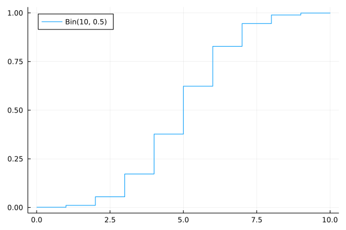
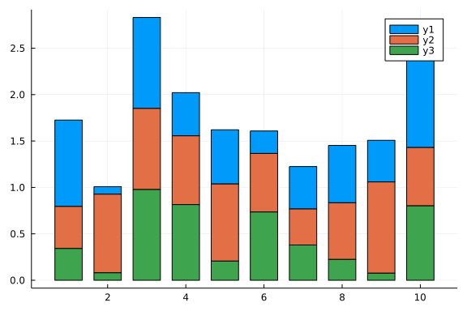

## Plot Recipes and Recipe Libraries

Plotting recipes are extensions to the Plots.jl framework. They add:

1. New `plot` commands via **user recipes**.
2. Default interpretations of Julia types as plotting data via **type recipes**.
3. New functions for generating plots via **plot recipes**.
4. New series types via **series recipes**.

Recipes are included in many recipe libraries. We will introduce StatsPlots.jl which adds a bunch of recipes including:

1. a type recipe for `Distribution`s;
2. a plot recipe for marginal histograms;
3. a bunch of new statistical plot series.

Besides recipes, StatsPlots.jl also provides a specialized macro from plotting directly from data tables.

### Using User Recipes

A user recipe says how to interpret plotting commands on a new data type.
In this case, StatsPlots.jl thus has a macro `@df` which allows you to plot
a `DataFrame` directly by using the column names. 

Without StatsPlots.jl:

```julia
julia> using DataFrames, Plots

julia> df = DataFrame(a = 1:10, b = 10 * rand(10), c = 10 * rand(10))
10×3 DataFrame
 Row │ a      b         c
     │ Int64  Float64   Float64
─────┼───────────────────────────
   1 │     1  6.84276   9.13339
   2 │     2  8.8735    1.67278
   3 │     3  0.943879  0.913765
   4 │     4  6.80665   8.91251
   5 │     5  8.57071   3.83039
   6 │     6  4.75371   4.84181
   7 │     7  5.2452    4.62759
   8 │     8  7.80776   8.60463
   9 │     9  0.699677  3.60096
  10 │    10  6.74647   5.19491

julia> plot(df.a, [df.b df.c])
```


With StatsPlots.jl: Plot the DataFrame by declaring the points by the column names

```julia
julia> # Pkg.add("StatsPlots")
       using StatsPlots # Required for the DataFrame user recipe

julia> @df df plot(:a, [:b :c])
```


Notice there's not much you have to do here: all of the commands from before
(attributes, series types, etc.) will still work on this data:

```julia
julia> @df df scatter(:a, :b, title = "My DataFrame Scatter Plot!") # x = :a, y = :b
```


### Using a Type Recipe

In addition, StatsPlots.jl extends Distributions.jl by adding a type recipe
for its distribution types, so they can be directly interpreted as plotting
data:

```julia
julia> using Distributions

julia> plot(Normal(3, 5), lw = 3)
```


Thus type recipes are a very convenient way to plot a specialized type which
requires no more intervention!

### Using Plot Recipes

StatsPlots.jl adds the `marginhist` multiplot via a plot recipe. 

```julia
julia> df = DataFrame(x = randn(1000), y = randn(1000))
1000×2 DataFrame
  Row │ x           y
      │ Float64     Float64
──────┼────────────────────────
    1 │ -0.330133    0.332644
    2 │  0.42702    -0.191715
    3 │ -0.479123   -0.720681
    4 │ -1.22383     1.02316
    5 │  0.358909   -0.421797
    6 │  1.02341     0.32075
    7 │  1.1735     -1.26166
    8 │  2.2291      0.660178
  ⋮   │     ⋮           ⋮
  994 │  0.128496   -1.62802
  995 │ -0.718981    0.0481539
  996 │ -1.19419    -0.313739
  997 │ -0.227794   -1.34697
  998 │  1.11294     0.502029
  999 │  0.178576    0.561966
 1000 │  1.06783     1.19604
               985 rows omitted

julia> @df df marginalhist(:x, :y)
```


```julia
julia> @df df marginalhist(:x, :y, bins=(10, 10))
```


### Using Series Recipes

StatsPlots.jl also introduces new series recipes. The key is that you don't have
to do anything differently: after `using StatsPlots` you can simply use those
new series recipes as though they were built into the plotting libraries. Let's
use the Violin plot on some random data:

```julia
julia> y = randn(100, 4) # Four series of 100 points each
100×4 Matrix{Float64}:
  1.71375     0.0275417  -1.96412     0.870247
  0.105143   -1.84348     0.0922733  -0.777717
 -0.40016     0.884739   -1.52038     0.106269
  0.658385   -0.135182    0.935861    1.49685
 -0.254339    0.429079    0.510217    0.311451
 -0.744432   -2.07012     0.164632    0.491821
 -1.03633    -0.643737    1.02663     0.940912
  1.27488    -0.213743   -1.18052     0.512127
 -2.17762    -1.64883     1.19942     1.10603
 -0.735728    2.0106     -0.117892    0.387572
  ⋮                                  
 -1.92439     0.116503    1.38833    -1.4848
 -0.0876331   0.342778   -1.38948     0.0051094
  0.785221   -1.25015     1.74679     1.89836
  0.840459   -0.590026    0.0665306  -0.63921
 -0.372106   -0.740129   -0.495205    1.79036
 -1.23993    -0.798198    0.0253507  -1.23338
  1.23844     0.322347    0.283395   -0.547803
  0.651865    1.63414     0.748354   -0.338767
  0.808638    1.03791    -1.30806     0.509537

julia> histogram(y[:,1], normalize=true)
```


```julia
julia> density(y[:,1])
```


```julia
julia> violin(["y1"], y[:,1])
```


```julia
julia> boxplot!(["y1"], y[:,1])
```


```julia
julia> violin(["Series 1" "Series 2" "Series 3" "Series 4"], y, leg = false)
```


and we can add a `boxplot` on top using the same mutation commands as before:

```julia
julia> boxplot!(["Series 1" "Series 2" "Series 3" "Series 4"], y, leg = false)
```


## Additional Addons To Try

Inside a `@df` macro call, the `cols` utility function can be used to refer to a range of columns:

```julia
julia> df = DataFrame(a = 1:10, b = 10 .* rand(10), c = 10 .* rand(10))
10×3 DataFrame
 Row │ a      b          c
     │ Int64  Float64    Float64
─────┼───────────────────────────
   1 │     1  2.99689    1.59869
   2 │     2  1.016      5.28751
   3 │     3  9.24021    7.01252
   4 │     4  1.59633    3.98799
   5 │     5  5.76768    5.54789
   6 │     6  8.61101    7.99628
   7 │     7  4.22319    3.59373
   8 │     8  0.0234182  4.08973
   9 │     9  4.38379    3.70347
  10 │    10  7.51743    2.27739

julia> @df df plot(:a, cols(2:3), color = [:red :blue])
```


```julia
julia> using RDatasets

julia> school = RDatasets.dataset("mlmRev","Hsb82")
7185×8 DataFrame
  Row │ School  Minrty  Sx      SSS      MAch     MeanSES    Sector    CSES    ⋯
      │ Cat…    Cat…    Cat…    Float64  Float64  Float64    Cat…      Float64 ⋯
──────┼─────────────────────────────────────────────────────────────────────────
    1 │ 1224    No      Female   -1.528    5.876  -0.434383  Public    -1.0936 ⋯
    2 │ 1224    No      Female   -0.588   19.708  -0.434383  Public    -0.1536
    3 │ 1224    No      Male     -0.528   20.349  -0.434383  Public    -0.0936
    4 │ 1224    No      Male     -0.668    8.781  -0.434383  Public    -0.2336
    5 │ 1224    No      Male     -0.158   17.898  -0.434383  Public     0.2763 ⋯
    6 │ 1224    No      Male      0.022    4.583  -0.434383  Public     0.4563
    7 │ 1224    No      Female   -0.618   -2.832  -0.434383  Public    -0.1836
    8 │ 1224    No      Male     -0.998    0.523  -0.434383  Public    -0.5636
  ⋮   │   ⋮       ⋮       ⋮        ⋮        ⋮         ⋮         ⋮          ⋮   ⋱
 7179 │ 9586    No      Female    1.022   22.78    0.621153  Catholic   0.4008 ⋯
 7180 │ 9586    Yes     Female    1.612   20.967   0.621153  Catholic   0.9908
 7181 │ 9586    No      Female    1.512   20.402   0.621153  Catholic   0.8908
 7182 │ 9586    No      Female   -0.038   14.794   0.621153  Catholic  -0.6591
 7183 │ 9586    No      Female    1.332   19.641   0.621153  Catholic   0.7108 ⋯
 7184 │ 9586    No      Female   -0.008   16.241   0.621153  Catholic  -0.6291
 7185 │ 9586    No      Female    0.792   22.733   0.621153  Catholic   0.1708
                                                  1 column and 7170 rows omitted

julia> @df school density(:MAch, group = :Sx)
```


```julia
julia> @df school density(:MAch, group = (:Sx, :Sector), legend = :topleft)
```


```julia
julia> x, y = randn(1000), randn(1000);

julia> marginalkde(x, x+y, levels=20)
```


* `levels=N` can be used to set the number of contour levels (default 10); levels are evenly-spaced in the cumulative probability mass.
* `clip=((-xl, xh), (-yl, yh))` (default `((-3, 3), (-3, 3))`) can be used to adjust the bounds of the plot.  Clip values are expressed as multiples of the `[0.16-0.5]` and `[0.5,0.84]` percentiles of the underlying 1D distributions (these would be 1-sigma ranges for a Gaussian).
  marginalkde(x, x+y, levels=20)

## corrplot and cornerplot

This plot type shows the correlation among input variables. The marker color in scatter plots reveal the degree of correlation. Pass the desired colorgradient to `markercolor`. With the default gradient positive correlations are blue, neutral are yellow and negative are red. In the 2d-histograms the color gradient show the frequency of points in that bin (as usual controlled by `seriescolor`).

```julia
julia> M = randn(1000,4);

julia> M[:,2] .+= 0.8sqrt.(abs.(M[:,1])) .- 0.5M[:,3] .+ 5;

julia> M[:,3] .-= 0.7M[:,1].^2 .+ 2;

julia> corrplot(M, label = ["x$i" for i=1:4])
```


```julia
julia> cornerplot(M)
```


```julia
julia> cornerplot(M, compact=true)
```


Asymmetric violin or dot plots can be created using the `side` keyword (`:both` - default,`:right` or `:left`):

```julia
julia> singers = RDatasets.dataset("lattice", "singer")
235×2 DataFrame
 Row │ Height  VoicePart
     │ Int32   Cat…
─────┼───────────────────
   1 │     64  Soprano 1
   2 │     62  Soprano 1
   3 │     66  Soprano 1
   4 │     65  Soprano 1
   5 │     60  Soprano 1
   6 │     61  Soprano 1
   7 │     65  Soprano 1
   8 │     66  Soprano 1
  ⋮  │   ⋮         ⋮
 229 │     70  Bass 2
 230 │     70  Bass 2
 231 │     69  Bass 2
 232 │     72  Bass 2
 233 │     71  Bass 2
 234 │     74  Bass 2
 235 │     75  Bass 2
         220 rows omitted

julia> singers_moscow = deepcopy(singers)
235×2 DataFrame
 Row │ Height  VoicePart
     │ Int32   Cat…
─────┼───────────────────
   1 │     64  Soprano 1
   2 │     62  Soprano 1
   3 │     66  Soprano 1
   4 │     65  Soprano 1
   5 │     60  Soprano 1
   6 │     61  Soprano 1
   7 │     65  Soprano 1
   8 │     66  Soprano 1
  ⋮  │   ⋮         ⋮
 229 │     70  Bass 2
 230 │     70  Bass 2
 231 │     69  Bass 2
 232 │     72  Bass 2
 233 │     71  Bass 2
 234 │     74  Bass 2
 235 │     75  Bass 2
         220 rows omitted

julia> singers_moscow[!, :Height] = singers_moscow[!, :Height] .+ 5
235-element Vector{Int64}:
 69
 67
 71
 70
 65
 66
 70
 71
 70
 68
  ⋮
 77
 72
 75
 75
 74
 77
 76
 79
 80

julia> @df singers violin(string.(:VoicePart), :Height, side=:right, linewidth=0, label="Scala")
```


```julia
julia> @df singers_moscow violin!(string.(:VoicePart), :Height, side=:left, linewidth=0, label="Moscow")
```


## Equal-area histograms

The ea-histogram is an alternative histogram implementation, where every 'box' in the histogram contains the same number of sample points and all boxes have the same area. Areas with a higher density of points thus get higher boxes. This type of histogram shows spikes well, but may oversmooth in the tails. The y axis is not intuitively interpretable.

```julia
julia> a = [randn(100); randn(100) .+ 3; randn(100) ./ 2 .+ 3]
300-element Vector{Float64}:
  2.330644044347653
  0.7621092421446852
  0.1947882963305201
  0.2981849378176639
  0.5234927225036521
  0.4565416976690832
 -0.05646593238291585
  0.4720435813795882
 -0.18170707245800774
  0.7580694331125354
  ⋮
  1.8252291962063925
  2.3133993085929156
  3.4642260786032413
  2.5403662938511125
  2.2056956065041993
  3.2339323306432295
  4.0606299910243155
  3.5539005319163413
  3.358376625298137

julia> p1 = histogram(a)
```


```julia
julia> p2 = ea_histogram(a, bins = :scott, fillalpha = 0.4)
```


```julia
julia> plot(p1, p2, layout=(1, 2))
```


## AndrewsPlot

[AndrewsPlots](https://en.wikipedia.org/wiki/Andrews_plot) are a way to visualize structure in high-dimensional data by depicting each row of an array or table as a line that varies with the values in columns. 

```julia
julia> iris = dataset("datasets", "iris")
150×5 DataFrame
 Row │ SepalLength  SepalWidth  PetalLength  PetalWidth  Species
     │ Float64      Float64     Float64      Float64     Cat…
─────┼─────────────────────────────────────────────────────────────
   1 │         5.1         3.5          1.4         0.2  setosa
   2 │         4.9         3.0          1.4         0.2  setosa
   3 │         4.7         3.2          1.3         0.2  setosa
   4 │         4.6         3.1          1.5         0.2  setosa
   5 │         5.0         3.6          1.4         0.2  setosa
   6 │         5.4         3.9          1.7         0.4  setosa
   7 │         4.6         3.4          1.4         0.3  setosa
   8 │         5.0         3.4          1.5         0.2  setosa
  ⋮  │      ⋮           ⋮            ⋮           ⋮           ⋮
 144 │         6.8         3.2          5.9         2.3  virginica
 145 │         6.7         3.3          5.7         2.5  virginica
 146 │         6.7         3.0          5.2         2.3  virginica
 147 │         6.3         2.5          5.0         1.9  virginica
 148 │         6.5         3.0          5.2         2.0  virginica
 149 │         6.2         3.4          5.4         2.3  virginica
 150 │         5.9         3.0          5.1         1.8  virginica
                                                   135 rows omitted

julia> @df iris andrewsplot(:Species, cols(1:4), legend = :topleft)
```


```julia
julia> andrewsplot(reshape(1:15, 3,5))
```


Distributions

```julia
julia> using Distributions

julia> plot(Normal(3,5), fill=(0, .5,:orange))
```


```julia
julia> dist = Gamma(2)
Gamma{Float64}(α=2.0, θ=1.0)

julia> scatter(dist, leg=false)
```


```julia
julia> bar!(dist, func=cdf, alpha=0.3)
```


```julia
julia> bin1 = Binomial(20, 0.5)
Binomial{Float64}(n=20, p=0.5)

julia> bin2 = Binomial(10, 0.1)
Binomial{Float64}(n=10, p=0.1)

julia> bin3 = Binomial(10, 0.9)
Binomial{Float64}(n=10, p=0.9)

julia> p1 = bar(bin1, func=pdf, label="Bin$(params(bin1))", legend=:topleft)
```


```julia
julia> p2 = bar(bin2, func=pdf, label="Bin$(params(bin2))", legend=:top)
```


```julia
julia> bar!(bin3, func=pdf, label="Bin$(params(bin3))")
```


```julia
julia> plot(p1, p2, size=0.8 .*(1000, 500))
```


```julia
julia> p3 = plot(Normal(5, 1), label="N(5, 1)")
```


```julia
julia> plot!(Normal(5, 3), label="N(5, 3)")
```


```julia
julia> p4 = plot(Normal(15, 1), label="N(15, 1)")
```


```julia
julia> plot(p3, p4, size=0.4.*(1200, 500))
```


```julia
julia> d = Normal()
Normal{Float64}(μ=0.0, σ=1.0)

julia> p1 = plot(d, func=cdf, -4, 4, label="N(0, 1)", legend=:topleft)
```


```julia
julia> p1 = plot(x->x, x->cdf(d,x), -4, 4, label="N(0, 1)", legend=:topleft)
```


```julia
julia> d = Binomial(10, 0.5)
Binomial{Float64}(n=10, p=0.5)

julia> p2 = plot(d, func=cdf, 0, 10, label="Bin(10, 0.5)", legend=:topleft, linetype=:steppost)
```



```julia
julia> # p2 = plot(x->x, x->cdf(d,x), 0, 10, label="Bin(10, 0.5)", legend=:topleft, linetype=:steppre, m=:star)
       p2 = plot(0:10, cdf.(d,0:10), label="Bin(10, 0.5)", legend=:topleft, linetype=:steppost, m=:circle)
```


```julia
julia> # plot!(0:10, cdf.(d,0:10), seriestype=:scatter,label="")
       plot(p1, p2, size=0.7 .*(1000, 500))
```


```julia
julia> d = Normal(0, 1)
Normal{Float64}(μ=0.0, σ=1.0)

julia> plot(d, -3.5, 3.5, legend=false, size=0.9.*(500, 300),
            grid=false, ylim=(-0.03, 0.4), # background_color=:red,
            axis=false, ticks=false)
```


```julia
julia> plot!(d, -3.5, 1, fill=(0, 0.5, :blue))
```


```julia
julia> plot!([-3.5, -1], [0.29, 0.1])
```


```julia
julia> hline!([0])
```


```julia
julia> annotate!(-2.5, 0.3, "\$p=P(X\\leq x_p)\$")
```


```julia
julia> annotate!(1.1, -0.01, "\$x_p\$")
```


```julia
julia> annotate!(2.2, 0.2, "\$X\\sim N(\\mu,\\ \\sigma)\$")
```


### Quantile-Quantile plots

The `qqplot` function compares the quantiles of two distributions, and accepts either a vector of sample values or a `Distribution`. The `qqnorm` is a shorthand for comparing a distribution to the normal distribution. If the distributions are similar the points will be on a straight line.

```julia
julia> x, y, z = rand.((Normal(), Cauchy(), Normal()), 100)
([0.7304566376524584, 0.7379966978582276, 1.312141425461048, -0.040387759932251154, 0.2677854655306657, -0.3890682994303209, 0.4311731662910641, -0.7431377530396737, 0.10792852914060391, -0.8368824642302766  …  0.13400749995968078, 0.16157788867518288, -1.798091082852175, -0.016867703176076235, -1.1209349396845494, 1.4607473610027546, -1.18873660284499, 1.3975437171364251, -1.4235147993638477, -1.3957887388753356], [21.072559765120655, -0.6326100955003622, -13.186719925377036, -0.9592591642595555, -0.8989334245449528, 0.5485589006447164, -1.778423659609322, -0.10082561650850465, -2.4526156333319786, -3.1320046270609274  …  0.6555918534218701, 0.754912771594094, 0.4237533608126348, -0.3493596262084956, -0.5455145677438433, 45.59570325448124, 0.9811826111276795, -1.2858234356712142, -0.5586245995629757, 0.27769682705614784], [-0.017858644579092996, -0.2974907341061527, 0.3213403958971465, 1.1556776721270228, -0.06527797881079152, 0.5929138291316652, -0.2326758023452047, 0.51521249990636, 0.7359349300670018, 0.6507517683519862  …  0.2995935561062235, 0.780709518767826, 0.2430576948728568, -0.28738902464095234, -1.7217967251891106, 0.12551579409114058, -0.9153775727150072, -1.126474904072862, -0.13568445181593122, -0.7635170684536402])

julia> # m = length(x)
       # xs = sort(x)
       # p = collect((1:m ).- 0.5) ./ m
       # qz = quantile(z, p)
       # p1 = plot(xs, qz, seriestype=:scatter, legend=false)
       # p2 = qqplot(x, z)
       # plot(p1, p2)

       # qqplot of two samples, show a fitted regression line
       qqplot(x, y, qqline = :fit)
```


```julia
julia> qqplot(x, z, qqline = :fit)
```


compare with a Cauchy distribution fitted to y; pass an instance (e.g. Normal(0,1)) to compare with a specific distribution

```julia
julia> qqplot(Normal, 1 .+ 2x)
```


```julia
julia> qqplot(Normal(0, 1), 1 .+ 2x)
```


```julia
julia> qqplot(Cauchy, x)
```


```julia
julia> qqplot(Cauchy, y)
```


```julia
julia> # the :R default line passes through the 1st and 3rd quartiles of the distribution
       qqnorm(x, qqline = :R)
```


```julia
julia> using Random

julia> Random.seed!(0);

julia> n = 200;

julia> x = randn(n);

julia> y1 = 1 .+ 1.5randn(n);

julia> y2 = 1.5randn(n);

julia> y3 = rand(TDist(3), n);

julia> y4 = randn(n);

julia> y5 = 1 .+ randn(n);

julia> y = [y1 y2 y3 y4 y5];

julia> plot(qqplot(x, y1, title="x~N(0,1), y~N(1,1.5²)"),
            qqplot(x, y2, title="x~N(0,1), y~N(0,1.5²)"),
            qqplot(x, y3, title="x~N(0,1), y~T(df=3)"),
            qqplot(x, y4, title="x~N(0,1), y~N(0,1)"),
            qqplot(x, y5, title="x~N(0,1), y~N(1,1)"), size=6 .* (150, 100))
```


## Grouped Bar plots

```julia
julia> dat = rand(10,3)
10×3 Matrix{Float64}:
 0.930607   0.45348   0.341828
 0.0818308  0.846661  0.0803493
 0.980287   0.873491  0.977444
 0.465169   0.741209  0.814717
 0.584208   0.830454  0.206516
 0.242092   0.631292  0.735008
 0.457227   0.388113  0.379627
 0.617912   0.610255  0.224395
 0.448487   0.98303   0.0764172
 0.947461   0.628451  0.801462

julia> groupedbar(dat, bar_position=:stack, bar_width=0.7)
```



```julia
julia> groupedbar(dat, bar_width=0.7)
```


This is the default:

```julia
julia> groupedbar(dat, bar_position = :dodge, bar_width=0.7)
```


The `group` syntax is also possible in combination with `groupedbar`:

```julia
julia> ctg = repeat(["Category 1", "Category 2"], inner = 5)
10-element Vector{String}:
 "Category 1"
 "Category 1"
 "Category 1"
 "Category 1"
 "Category 1"
 "Category 2"
 "Category 2"
 "Category 2"
 "Category 2"
 "Category 2"

julia> nam = repeat("G" .* string.(1:5), outer = 2)
10-element Vector{String}:
 "G1"
 "G2"
 "G3"
 "G4"
 "G5"
 "G1"
 "G2"
 "G3"
 "G4"
 "G5"

julia> dat = rand(5, 2)
5×2 Matrix{Float64}:
 0.32551   0.0913765
 0.748899  0.891251
 0.162963  0.383039
 0.913339  0.833913
 0.167278  0.455686

julia> groupedbar(nam, dat, group = ctg, xlabel = "Groups", ylabel = "Scores",
               title = "Scores by group and category", bar_width = 0.67,
               lw = 0, framestyle = :box)
```


