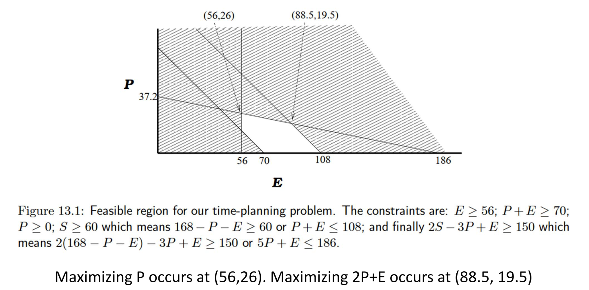

# Linear Programming

## Example

- There are 168 hours in a week. Want to allocate our time between
   - studying (S)
   - going to parties (P)
   - everything else (E)
- To survive: E >= 56
- For sanity: P+E >= 70
- To pass courses: S >= 60
- If party a lot, need to study or eat more: 2S + E - 3P >= 150
- Is there a *feasible* solution? Yes, S = 80, P = 20, E = 68
- Happiness is 2P + E. Find a feasible solution that maximizes this *objective function*.

## Linear Program

- This is called a *linear program (LP)*
- All constraints are linear in our variables
- Objective function is linear
- Don’t allow S⋅E >= 100, which is a polynomial program and is much harder.

**Formal Definition**

- Given:
   - n variables x_1, ..., x_n
   - m linear inequalities in these variables
- Goal:
   - Find values for the x_i's that satisfy constraints and maximize or minimize the objective function
   - In the feasibility problem just satisfy the constraints

## [JuMP](https://github.com/jump-dev/JuMP.jl)

It supports a number of
open-source and commercial solvers for a variety of problem classes, including
linear, mixed-integer, second-order conic, semidefinite, and nonlinear
programming.

## Installation

JuMP is a package for Julia. From Julia, JuMP is installed by using the
built-in package manager.

```julia
import Pkg
Pkg.add("JuMP")
```


You also need to include a Julia package which provides an appropriate solver.
One such solver is `GLPK.Optimizer`, which is provided by the
[GLPK.jl package](https://github.com/jump-dev/GLPK.jl).
```julia
import Pkg
Pkg.add("GLPK")
```


See [Installation Guide](https://jump.dev/JuMP.jl/stable/installation/) for a list of other solvers you can use.

## An example

Let's to solve the following linear programming problem using JuMP and GLPK.
We will first look at the complete code to solve the problem and then go
through it step by step.

Here's the problem:

- minimize:  12x + 20y
- s.t. 
  - 6x + 8y >= 100
  - 7x + 12y >= 120
  - x >= 0
  - 0 <= y <= 3

<!-- ```latex -->
<!-- \begin{aligned} -->
<!-- & \min & 12x + 20y \\ -->
<!-- & \;\;\text{s.t.} & 6x + 8y \geq 100 \\ -->
<!-- & & 7x + 12y \geq 120 \\ -->
<!-- & & x \geq 0 \\ -->
<!-- & & y \in [0, 3] \\ -->
<!-- \end{aligned} -->
<!-- ``` -->

And here's the code to solve this problem:
```julia
julia> # We want to use `GLPK.Optimizer` here which is provided by the `GLPK.jl`
       # package.
       using JuMP, GLPK

julia> # JuMP builds problems incrementally in a `Model` object. Create a model by
       # passing an optimizer to the `Model` function:
       model = Model(GLPK.Optimizer)
A JuMP Model
Feasibility problem with:
Variables: 0
Model mode: AUTOMATIC
CachingOptimizer state: EMPTY_OPTIMIZER
Solver name: GLPK

julia> # Variables are modeled using `variable`:
       @variable(model, x >= 0)
x

julia> # They can have lower and upper bounds.
       @variable(model, 0 <= y <= 30)
y

julia> # The objective is set using `objective`:
       @objective(model, Min, 12x + 20y)
12 x + 20 y

julia> # Constraints are modeled using `constraint`. Here, `c1` and `c2` are
       # the names of our constraint.
       @constraint(model, c1, 6x + 8y >= 100)
c1 : 6 x + 8 y ≥ 100.0

julia> @constraint(model, c2, 7x + 12y >= 120)
c2 : 7 x + 12 y ≥ 120.0

julia> # Call `print` to display the model:
       print(model)
Min 12 x + 20 y
Subject to
 c1 : 6 x + 8 y ≥ 100.0
 c2 : 7 x + 12 y ≥ 120.0
 x ≥ 0.0
 y ≥ 0.0
 y ≤ 30.0

julia> # To solve the optimization problem, call the `optimize!` function.
       optimize!(model)

julia> # Now let's see what information we can query about the solution.
       # `termination_status` tells us why the solver stopped:
       termination_status(model)
OPTIMAL::TerminationStatusCode = 1

julia> # In this case, the solver found an optimal solution.
       
       # Query the objective value using `objective_value`:
       objective_value(model)
205.0

julia> # the primal solution using `value`:
       value(x), value(y)
(14.999999999999993, 1.2500000000000047)
```


Maximum Happiness
```julia
happiness = Model(GLPK.Optimizer)
@variable(happiness, E >= 56)
@variable(happiness, P >= 0)
@variable(happiness, S >= 60)
@constraint(happiness, c1, P + E >= 70)
@constraint(happiness, c2, 2S + E - 3P >= 150)
@constraint(happiness, c3, S + P + E == 168)
@objective(happiness, Max, 2P + E)
print(happiness)
optimize!(happiness)
termination_status(happiness)
objective_value(happiness)
value(E)
value(P)
value(S)

happiness = Model(GLPK.Optimizer)
@variable(happiness, E >= 56)
@variable(happiness, P >= 0)
@constraint(happiness, 108 >= P + E >= 70)
@constraint(happiness, 5P + E <= 186)
@objective(happiness, Max, 2P + E)
print(happiness)
optimize!(happiness)
termination_status(happiness)
objective_value(happiness)
value(E), value(P)
```

```
Max 2 P + E
Subject to
 c3 : E + P + S = 168.0
 c1 : E + P ≥ 70.0
 c2 : E - 3 P + 2 S ≥ 150.0
 E ≥ 56.0
 P ≥ 0.0
 S ≥ 60.0
Max 2 P + E
Subject to
 E + 5 P ≤ 186.0
 E + P ∈ [70.0, 108.0]
 E ≥ 56.0
 P ≥ 0.0
(88.5, 19.5)
```


Here is some intuition for Linear Programming




