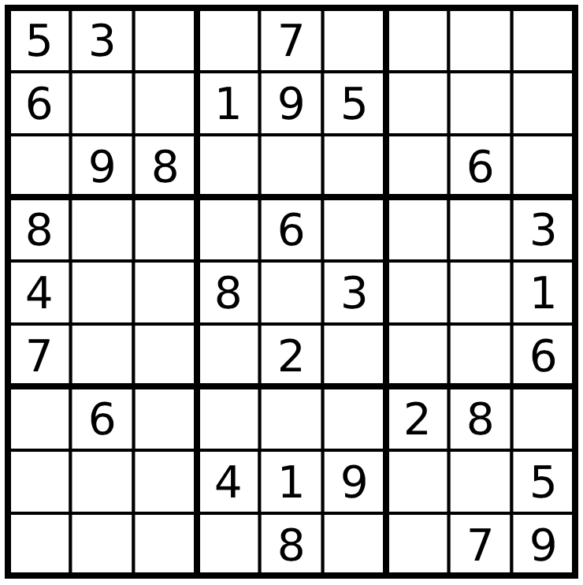

[Sudoku](http://en.wikipedia.org/wiki/Sudoku) is a popular number puzzle. The
goal is to place the digits 1,...,9 on a nine-by-nine grid, with some of the
digits already filled in. Your solution must satisfy the following rules:

* The numbers 1 to 9 must appear in each 3x3 square
* The numbers 1 to 9 must appear in each row
* The numbers 1 to 9 must appear in each column

Sudoku has been used in statistics for producing new space-filling design in
field of experimental design, e.g., [Sudoku-based space-filling designs](https://www.tandfonline.com/doi/abs/10.1080/00031305.2015.1114970?journalCode=utas20) and [Samurai Sudoku-Based Space-Filling Designs](https://academic.oup.com/biomet/article-abstract/98/3/711/236038?redirectedFrom=fulltext)

Here is a Sudoku game:



Solving a Sudoku isn't an optimization problem with an objective; its actually
a *feasibility* problem: we wish to find a feasible solution that satisfies
these rules. You can think of it as an optimization problem with an objective
of 0.

We can model this problem using 0-1 integer programming: a problem where all
the decision variables are binary. We'll use JuMP to create the model, and
then we can solve it with any integer programming solver.

```julia
julia> using JuMP, GLPK
```

We will define a binary variable for each possible number in each possible
cell:
`x[i,j,k] = 1 if and only if cell (i,j) has number k`,
where `i` is the row and `j` is the column.

Create a model

```julia
julia> sudoku = Model(GLPK.Optimizer)
A JuMP Model
Feasibility problem with:
Variables: 0
Model mode: AUTOMATIC
CachingOptimizer state: EMPTY_OPTIMIZER
Solver name: GLPK
```

Create our variables

```julia
julia> @variable(sudoku, x[i = 1:9, j = 1:9, k = 1:9], Bin)
9×9×9 Array{VariableRef, 3}:
[:, :, 1] =
 x[1,1,1]  x[1,2,1]  x[1,3,1]  x[1,4,1]  …  x[1,7,1]  x[1,8,1]  x[1,9,1]
 x[2,1,1]  x[2,2,1]  x[2,3,1]  x[2,4,1]     x[2,7,1]  x[2,8,1]  x[2,9,1]
 x[3,1,1]  x[3,2,1]  x[3,3,1]  x[3,4,1]     x[3,7,1]  x[3,8,1]  x[3,9,1]
 x[4,1,1]  x[4,2,1]  x[4,3,1]  x[4,4,1]     x[4,7,1]  x[4,8,1]  x[4,9,1]
 x[5,1,1]  x[5,2,1]  x[5,3,1]  x[5,4,1]     x[5,7,1]  x[5,8,1]  x[5,9,1]
 x[6,1,1]  x[6,2,1]  x[6,3,1]  x[6,4,1]  …  x[6,7,1]  x[6,8,1]  x[6,9,1]
 x[7,1,1]  x[7,2,1]  x[7,3,1]  x[7,4,1]     x[7,7,1]  x[7,8,1]  x[7,9,1]
 x[8,1,1]  x[8,2,1]  x[8,3,1]  x[8,4,1]     x[8,7,1]  x[8,8,1]  x[8,9,1]
 x[9,1,1]  x[9,2,1]  x[9,3,1]  x[9,4,1]     x[9,7,1]  x[9,8,1]  x[9,9,1]

[:, :, 2] =
 x[1,1,2]  x[1,2,2]  x[1,3,2]  x[1,4,2]  …  x[1,7,2]  x[1,8,2]  x[1,9,2]
 x[2,1,2]  x[2,2,2]  x[2,3,2]  x[2,4,2]     x[2,7,2]  x[2,8,2]  x[2,9,2]
 x[3,1,2]  x[3,2,2]  x[3,3,2]  x[3,4,2]     x[3,7,2]  x[3,8,2]  x[3,9,2]
 x[4,1,2]  x[4,2,2]  x[4,3,2]  x[4,4,2]     x[4,7,2]  x[4,8,2]  x[4,9,2]
 x[5,1,2]  x[5,2,2]  x[5,3,2]  x[5,4,2]     x[5,7,2]  x[5,8,2]  x[5,9,2]
 x[6,1,2]  x[6,2,2]  x[6,3,2]  x[6,4,2]  …  x[6,7,2]  x[6,8,2]  x[6,9,2]
 x[7,1,2]  x[7,2,2]  x[7,3,2]  x[7,4,2]     x[7,7,2]  x[7,8,2]  x[7,9,2]
 x[8,1,2]  x[8,2,2]  x[8,3,2]  x[8,4,2]     x[8,7,2]  x[8,8,2]  x[8,9,2]
 x[9,1,2]  x[9,2,2]  x[9,3,2]  x[9,4,2]     x[9,7,2]  x[9,8,2]  x[9,9,2]

[:, :, 3] =
 x[1,1,3]  x[1,2,3]  x[1,3,3]  x[1,4,3]  …  x[1,7,3]  x[1,8,3]  x[1,9,3]
 x[2,1,3]  x[2,2,3]  x[2,3,3]  x[2,4,3]     x[2,7,3]  x[2,8,3]  x[2,9,3]
 x[3,1,3]  x[3,2,3]  x[3,3,3]  x[3,4,3]     x[3,7,3]  x[3,8,3]  x[3,9,3]
 x[4,1,3]  x[4,2,3]  x[4,3,3]  x[4,4,3]     x[4,7,3]  x[4,8,3]  x[4,9,3]
 x[5,1,3]  x[5,2,3]  x[5,3,3]  x[5,4,3]     x[5,7,3]  x[5,8,3]  x[5,9,3]
 x[6,1,3]  x[6,2,3]  x[6,3,3]  x[6,4,3]  …  x[6,7,3]  x[6,8,3]  x[6,9,3]
 x[7,1,3]  x[7,2,3]  x[7,3,3]  x[7,4,3]     x[7,7,3]  x[7,8,3]  x[7,9,3]
 x[8,1,3]  x[8,2,3]  x[8,3,3]  x[8,4,3]     x[8,7,3]  x[8,8,3]  x[8,9,3]
 x[9,1,3]  x[9,2,3]  x[9,3,3]  x[9,4,3]     x[9,7,3]  x[9,8,3]  x[9,9,3]

[:, :, 4] =
 x[1,1,4]  x[1,2,4]  x[1,3,4]  x[1,4,4]  …  x[1,7,4]  x[1,8,4]  x[1,9,4]
 x[2,1,4]  x[2,2,4]  x[2,3,4]  x[2,4,4]     x[2,7,4]  x[2,8,4]  x[2,9,4]
 x[3,1,4]  x[3,2,4]  x[3,3,4]  x[3,4,4]     x[3,7,4]  x[3,8,4]  x[3,9,4]
 x[4,1,4]  x[4,2,4]  x[4,3,4]  x[4,4,4]     x[4,7,4]  x[4,8,4]  x[4,9,4]
 x[5,1,4]  x[5,2,4]  x[5,3,4]  x[5,4,4]     x[5,7,4]  x[5,8,4]  x[5,9,4]
 x[6,1,4]  x[6,2,4]  x[6,3,4]  x[6,4,4]  …  x[6,7,4]  x[6,8,4]  x[6,9,4]
 x[7,1,4]  x[7,2,4]  x[7,3,4]  x[7,4,4]     x[7,7,4]  x[7,8,4]  x[7,9,4]
 x[8,1,4]  x[8,2,4]  x[8,3,4]  x[8,4,4]     x[8,7,4]  x[8,8,4]  x[8,9,4]
 x[9,1,4]  x[9,2,4]  x[9,3,4]  x[9,4,4]     x[9,7,4]  x[9,8,4]  x[9,9,4]

[:, :, 5] =
 x[1,1,5]  x[1,2,5]  x[1,3,5]  x[1,4,5]  …  x[1,7,5]  x[1,8,5]  x[1,9,5]
 x[2,1,5]  x[2,2,5]  x[2,3,5]  x[2,4,5]     x[2,7,5]  x[2,8,5]  x[2,9,5]
 x[3,1,5]  x[3,2,5]  x[3,3,5]  x[3,4,5]     x[3,7,5]  x[3,8,5]  x[3,9,5]
 x[4,1,5]  x[4,2,5]  x[4,3,5]  x[4,4,5]     x[4,7,5]  x[4,8,5]  x[4,9,5]
 x[5,1,5]  x[5,2,5]  x[5,3,5]  x[5,4,5]     x[5,7,5]  x[5,8,5]  x[5,9,5]
 x[6,1,5]  x[6,2,5]  x[6,3,5]  x[6,4,5]  …  x[6,7,5]  x[6,8,5]  x[6,9,5]
 x[7,1,5]  x[7,2,5]  x[7,3,5]  x[7,4,5]     x[7,7,5]  x[7,8,5]  x[7,9,5]
 x[8,1,5]  x[8,2,5]  x[8,3,5]  x[8,4,5]     x[8,7,5]  x[8,8,5]  x[8,9,5]
 x[9,1,5]  x[9,2,5]  x[9,3,5]  x[9,4,5]     x[9,7,5]  x[9,8,5]  x[9,9,5]

[:, :, 6] =
 x[1,1,6]  x[1,2,6]  x[1,3,6]  x[1,4,6]  …  x[1,7,6]  x[1,8,6]  x[1,9,6]
 x[2,1,6]  x[2,2,6]  x[2,3,6]  x[2,4,6]     x[2,7,6]  x[2,8,6]  x[2,9,6]
 x[3,1,6]  x[3,2,6]  x[3,3,6]  x[3,4,6]     x[3,7,6]  x[3,8,6]  x[3,9,6]
 x[4,1,6]  x[4,2,6]  x[4,3,6]  x[4,4,6]     x[4,7,6]  x[4,8,6]  x[4,9,6]
 x[5,1,6]  x[5,2,6]  x[5,3,6]  x[5,4,6]     x[5,7,6]  x[5,8,6]  x[5,9,6]
 x[6,1,6]  x[6,2,6]  x[6,3,6]  x[6,4,6]  …  x[6,7,6]  x[6,8,6]  x[6,9,6]
 x[7,1,6]  x[7,2,6]  x[7,3,6]  x[7,4,6]     x[7,7,6]  x[7,8,6]  x[7,9,6]
 x[8,1,6]  x[8,2,6]  x[8,3,6]  x[8,4,6]     x[8,7,6]  x[8,8,6]  x[8,9,6]
 x[9,1,6]  x[9,2,6]  x[9,3,6]  x[9,4,6]     x[9,7,6]  x[9,8,6]  x[9,9,6]

[:, :, 7] =
 x[1,1,7]  x[1,2,7]  x[1,3,7]  x[1,4,7]  …  x[1,7,7]  x[1,8,7]  x[1,9,7]
 x[2,1,7]  x[2,2,7]  x[2,3,7]  x[2,4,7]     x[2,7,7]  x[2,8,7]  x[2,9,7]
 x[3,1,7]  x[3,2,7]  x[3,3,7]  x[3,4,7]     x[3,7,7]  x[3,8,7]  x[3,9,7]
 x[4,1,7]  x[4,2,7]  x[4,3,7]  x[4,4,7]     x[4,7,7]  x[4,8,7]  x[4,9,7]
 x[5,1,7]  x[5,2,7]  x[5,3,7]  x[5,4,7]     x[5,7,7]  x[5,8,7]  x[5,9,7]
 x[6,1,7]  x[6,2,7]  x[6,3,7]  x[6,4,7]  …  x[6,7,7]  x[6,8,7]  x[6,9,7]
 x[7,1,7]  x[7,2,7]  x[7,3,7]  x[7,4,7]     x[7,7,7]  x[7,8,7]  x[7,9,7]
 x[8,1,7]  x[8,2,7]  x[8,3,7]  x[8,4,7]     x[8,7,7]  x[8,8,7]  x[8,9,7]
 x[9,1,7]  x[9,2,7]  x[9,3,7]  x[9,4,7]     x[9,7,7]  x[9,8,7]  x[9,9,7]

[:, :, 8] =
 x[1,1,8]  x[1,2,8]  x[1,3,8]  x[1,4,8]  …  x[1,7,8]  x[1,8,8]  x[1,9,8]
 x[2,1,8]  x[2,2,8]  x[2,3,8]  x[2,4,8]     x[2,7,8]  x[2,8,8]  x[2,9,8]
 x[3,1,8]  x[3,2,8]  x[3,3,8]  x[3,4,8]     x[3,7,8]  x[3,8,8]  x[3,9,8]
 x[4,1,8]  x[4,2,8]  x[4,3,8]  x[4,4,8]     x[4,7,8]  x[4,8,8]  x[4,9,8]
 x[5,1,8]  x[5,2,8]  x[5,3,8]  x[5,4,8]     x[5,7,8]  x[5,8,8]  x[5,9,8]
 x[6,1,8]  x[6,2,8]  x[6,3,8]  x[6,4,8]  …  x[6,7,8]  x[6,8,8]  x[6,9,8]
 x[7,1,8]  x[7,2,8]  x[7,3,8]  x[7,4,8]     x[7,7,8]  x[7,8,8]  x[7,9,8]
 x[8,1,8]  x[8,2,8]  x[8,3,8]  x[8,4,8]     x[8,7,8]  x[8,8,8]  x[8,9,8]
 x[9,1,8]  x[9,2,8]  x[9,3,8]  x[9,4,8]     x[9,7,8]  x[9,8,8]  x[9,9,8]

[:, :, 9] =
 x[1,1,9]  x[1,2,9]  x[1,3,9]  x[1,4,9]  …  x[1,7,9]  x[1,8,9]  x[1,9,9]
 x[2,1,9]  x[2,2,9]  x[2,3,9]  x[2,4,9]     x[2,7,9]  x[2,8,9]  x[2,9,9]
 x[3,1,9]  x[3,2,9]  x[3,3,9]  x[3,4,9]     x[3,7,9]  x[3,8,9]  x[3,9,9]
 x[4,1,9]  x[4,2,9]  x[4,3,9]  x[4,4,9]     x[4,7,9]  x[4,8,9]  x[4,9,9]
 x[5,1,9]  x[5,2,9]  x[5,3,9]  x[5,4,9]     x[5,7,9]  x[5,8,9]  x[5,9,9]
 x[6,1,9]  x[6,2,9]  x[6,3,9]  x[6,4,9]  …  x[6,7,9]  x[6,8,9]  x[6,9,9]
 x[7,1,9]  x[7,2,9]  x[7,3,9]  x[7,4,9]     x[7,7,9]  x[7,8,9]  x[7,9,9]
 x[8,1,9]  x[8,2,9]  x[8,3,9]  x[8,4,9]     x[8,7,9]  x[8,8,9]  x[8,9,9]
 x[9,1,9]  x[9,2,9]  x[9,3,9]  x[9,4,9]     x[9,7,9]  x[9,8,9]  x[9,9,9]
```

Now we can begin to add our constraints. We'll actually start with something
obvious to us as humans, but what we need to enforce: that there can be only
one number per cell.

```julia
julia> for i in 1:9, j in 1:9
           ## Sum across all the possible digits. One and only one of the digits
           ## can be in this cell, so the sum must be equal to one.
           @constraint(sudoku, sum(x[i, j, k] for k in 1:9) == 1)
       end
```

Next we'll add the constraints for the rows and the columns. These constraints
are all very similar, so much so that we can actually add them at the same
time.

```julia
julia> for ind in 1:9, k in 1:9 ## ind for Each row, OR each column
           @constraint(sudoku, sum(x[ind, j, k] for j in 1:9) == 1) # row constraint
           @constraint(sudoku, sum(x[i, ind, k] for i in 1:9) == 1) # column constraint
       end
```

Finally, we have the to enforce the constraint that each digit appears once in
each of the nine 3x3 sub-grids. Our strategy will be to index over the
top-left corners of each 3x3 square with `for` loops, then sum over the
squares.

```julia
julia> for i in 1:3:7, j in 1:3:7, k in 1:9
           ## i is the top left row, j is the top left column.
           ## We'll sum from i to i+2, e.g. i=4, r=4, 5, 6.
           @constraint(sudoku, sum(x[r, c, k] for r in i:(i+2), c in j:(j+2)) == 1)
       end
```

The final step is to add the initial solution as a set of constraints. We'll
solve the problem that is in the picture at the start of the tutorial. We'll
put a `0` if there is no digit in that location.

The given digits

```julia
julia> init_sol = [5 3 0 0 7 0 0 0 0
                   6 0 0 1 9 5 0 0 0
                   0 9 8 0 0 0 0 6 0
                   8 0 0 0 6 0 0 0 3
                   4 0 0 8 0 3 0 0 1
                   7 0 0 0 2 0 0 0 6
                   0 6 0 0 0 0 2 8 0
                   0 0 0 4 1 9 0 0 5
                   0 0 0 0 8 0 0 7 9]
9×9 Matrix{Int64}:
 5  3  0  0  7  0  0  0  0
 6  0  0  1  9  5  0  0  0
 0  9  8  0  0  0  0  6  0
 8  0  0  0  6  0  0  0  3
 4  0  0  8  0  3  0  0  1
 7  0  0  0  2  0  0  0  6
 0  6  0  0  0  0  2  8  0
 0  0  0  4  1  9  0  0  5
 0  0  0  0  8  0  0  7  9

julia> for i in 1:9, j in 1:9
           ## If the space isn't empty
           if init_sol[i, j] != 0
               ## the corresponding variable for that digit and location must be 1.
               fix(x[i, j, init_sol[i, j]], 1; force = true)
           end
       end
```

solve problem

```julia
julia> optimize!(sudoku)

julia> termination_status(sudoku)
OPTIMAL::TerminationStatusCode = 1

julia> objective_value(sudoku)
0.0
```

Extract the values of x

```julia
julia> x_val = value.(x)
9×9×9 Array{Float64, 3}:
[:, :, 1] =
 0.0  0.0  0.0  0.0  0.0  0.0  0.0  1.0  0.0
 0.0  0.0  0.0  1.0  0.0  0.0  0.0  0.0  0.0
 1.0  0.0  0.0  0.0  0.0  0.0  0.0  0.0  0.0
 0.0  0.0  0.0  0.0  0.0  1.0  0.0  0.0  0.0
 0.0  0.0  0.0  0.0  0.0  0.0  0.0  0.0  1.0
 0.0  1.0  0.0  0.0  0.0  0.0  0.0  0.0  0.0
 0.0  0.0  1.0  0.0  0.0  0.0  0.0  0.0  0.0
 0.0  0.0  0.0  0.0  1.0  0.0  0.0  0.0  0.0
 0.0  0.0  0.0  0.0  0.0  0.0  1.0  0.0  0.0

[:, :, 2] =
 0.0  0.0  0.0  0.0  0.0  0.0  0.0  0.0  1.0
 0.0  0.0  1.0  0.0  0.0  0.0  0.0  0.0  0.0
 0.0  0.0  0.0  0.0  0.0  1.0  0.0  0.0  0.0
 0.0  0.0  0.0  0.0  0.0  0.0  0.0  1.0  0.0
 0.0  1.0  0.0  0.0  0.0  0.0  0.0  0.0  0.0
 0.0  0.0  0.0  0.0  1.0  0.0  0.0  0.0  0.0
 0.0  0.0  0.0  0.0  0.0  0.0  1.0  0.0  0.0
 1.0  0.0  0.0  0.0  0.0  0.0  0.0  0.0  0.0
 0.0  0.0  0.0  1.0  0.0  0.0  0.0  0.0  0.0

[:, :, 3] =
 0.0  1.0  0.0  0.0  0.0  0.0  0.0  0.0  0.0
 0.0  0.0  0.0  0.0  0.0  0.0  1.0  0.0  0.0
 0.0  0.0  0.0  1.0  0.0  0.0  0.0  0.0  0.0
 0.0  0.0  0.0  0.0  0.0  0.0  0.0  0.0  1.0
 0.0  0.0  0.0  0.0  0.0  1.0  0.0  0.0  0.0
 0.0  0.0  1.0  0.0  0.0  0.0  0.0  0.0  0.0
 0.0  0.0  0.0  0.0  1.0  0.0  0.0  0.0  0.0
 0.0  0.0  0.0  0.0  0.0  0.0  0.0  1.0  0.0
 1.0  0.0  0.0  0.0  0.0  0.0  0.0  0.0  0.0

[:, :, 4] =
 0.0  0.0  1.0  0.0  0.0  0.0  0.0  0.0  0.0
 0.0  0.0  0.0  0.0  0.0  0.0  0.0  1.0  0.0
 0.0  0.0  0.0  0.0  1.0  0.0  0.0  0.0  0.0
 0.0  0.0  0.0  0.0  0.0  0.0  1.0  0.0  0.0
 1.0  0.0  0.0  0.0  0.0  0.0  0.0  0.0  0.0
 0.0  0.0  0.0  0.0  0.0  1.0  0.0  0.0  0.0
 0.0  0.0  0.0  0.0  0.0  0.0  0.0  0.0  1.0
 0.0  0.0  0.0  1.0  0.0  0.0  0.0  0.0  0.0
 0.0  1.0  0.0  0.0  0.0  0.0  0.0  0.0  0.0

[:, :, 5] =
 1.0  0.0  0.0  0.0  0.0  0.0  0.0  0.0  0.0
 0.0  0.0  0.0  0.0  0.0  1.0  0.0  0.0  0.0
 0.0  0.0  0.0  0.0  0.0  0.0  1.0  0.0  0.0
 0.0  1.0  0.0  0.0  0.0  0.0  0.0  0.0  0.0
 0.0  0.0  0.0  0.0  1.0  0.0  0.0  0.0  0.0
 0.0  0.0  0.0  0.0  0.0  0.0  0.0  1.0  0.0
 0.0  0.0  0.0  1.0  0.0  0.0  0.0  0.0  0.0
 0.0  0.0  0.0  0.0  0.0  0.0  0.0  0.0  1.0
 0.0  0.0  1.0  0.0  0.0  0.0  0.0  0.0  0.0

[:, :, 6] =
 0.0  0.0  0.0  1.0  0.0  0.0  0.0  0.0  0.0
 1.0  0.0  0.0  0.0  0.0  0.0  0.0  0.0  0.0
 0.0  0.0  0.0  0.0  0.0  0.0  0.0  1.0  0.0
 0.0  0.0  0.0  0.0  1.0  0.0  0.0  0.0  0.0
 0.0  0.0  1.0  0.0  0.0  0.0  0.0  0.0  0.0
 0.0  0.0  0.0  0.0  0.0  0.0  0.0  0.0  1.0
 0.0  1.0  0.0  0.0  0.0  0.0  0.0  0.0  0.0
 0.0  0.0  0.0  0.0  0.0  0.0  1.0  0.0  0.0
 0.0  0.0  0.0  0.0  0.0  1.0  0.0  0.0  0.0

[:, :, 7] =
 0.0  0.0  0.0  0.0  1.0  0.0  0.0  0.0  0.0
 0.0  1.0  0.0  0.0  0.0  0.0  0.0  0.0  0.0
 0.0  0.0  0.0  0.0  0.0  0.0  0.0  0.0  1.0
 0.0  0.0  0.0  1.0  0.0  0.0  0.0  0.0  0.0
 0.0  0.0  0.0  0.0  0.0  0.0  1.0  0.0  0.0
 1.0  0.0  0.0  0.0  0.0  0.0  0.0  0.0  0.0
 0.0  0.0  0.0  0.0  0.0  1.0  0.0  0.0  0.0
 0.0  0.0  1.0  0.0  0.0  0.0  0.0  0.0  0.0
 0.0  0.0  0.0  0.0  0.0  0.0  0.0  1.0  0.0

[:, :, 8] =
 0.0  0.0  0.0  0.0  0.0  1.0  0.0  0.0  0.0
 0.0  0.0  0.0  0.0  0.0  0.0  0.0  0.0  1.0
 0.0  0.0  1.0  0.0  0.0  0.0  0.0  0.0  0.0
 1.0  0.0  0.0  0.0  0.0  0.0  0.0  0.0  0.0
 0.0  0.0  0.0  1.0  0.0  0.0  0.0  0.0  0.0
 0.0  0.0  0.0  0.0  0.0  0.0  1.0  0.0  0.0
 0.0  0.0  0.0  0.0  0.0  0.0  0.0  1.0  0.0
 0.0  1.0  0.0  0.0  0.0  0.0  0.0  0.0  0.0
 0.0  0.0  0.0  0.0  1.0  0.0  0.0  0.0  0.0

[:, :, 9] =
 0.0  0.0  0.0  0.0  0.0  0.0  1.0  0.0  0.0
 0.0  0.0  0.0  0.0  1.0  0.0  0.0  0.0  0.0
 0.0  1.0  0.0  0.0  0.0  0.0  0.0  0.0  0.0
 0.0  0.0  1.0  0.0  0.0  0.0  0.0  0.0  0.0
 0.0  0.0  0.0  0.0  0.0  0.0  0.0  1.0  0.0
 0.0  0.0  0.0  1.0  0.0  0.0  0.0  0.0  0.0
 1.0  0.0  0.0  0.0  0.0  0.0  0.0  0.0  0.0
 0.0  0.0  0.0  0.0  0.0  1.0  0.0  0.0  0.0
 0.0  0.0  0.0  0.0  0.0  0.0  0.0  0.0  1.0
```

Create a matrix to store the solution

```julia
julia> sol = zeros(Int, 9, 9)  # 9x9 matrix of integers
9×9 Matrix{Int64}:
 0  0  0  0  0  0  0  0  0
 0  0  0  0  0  0  0  0  0
 0  0  0  0  0  0  0  0  0
 0  0  0  0  0  0  0  0  0
 0  0  0  0  0  0  0  0  0
 0  0  0  0  0  0  0  0  0
 0  0  0  0  0  0  0  0  0
 0  0  0  0  0  0  0  0  0
 0  0  0  0  0  0  0  0  0

julia> for i in 1:9, j in 1:9, k in 1:9
           ## Integer programs are solved as a series of linear programs so the
           ## values might not be precisely 0 and 1. We can just round them to
           ## the nearest integer to make it easier.
           if round(Int, x_val[i, j, k]) == 1
               sol[i, j] = k
           end
       end
```

Display the solution

```julia
julia> sol
9×9 Matrix{Int64}:
 5  3  4  6  7  8  9  1  2
 6  7  2  1  9  5  3  4  8
 1  9  8  3  4  2  5  6  7
 8  5  9  7  6  1  4  2  3
 4  2  6  8  5  3  7  9  1
 7  1  3  9  2  4  8  5  6
 9  6  1  5  3  7  2  8  4
 2  8  7  4  1  9  6  3  5
 3  4  5  2  8  6  1  7  9
```

Which is the correct solution:


